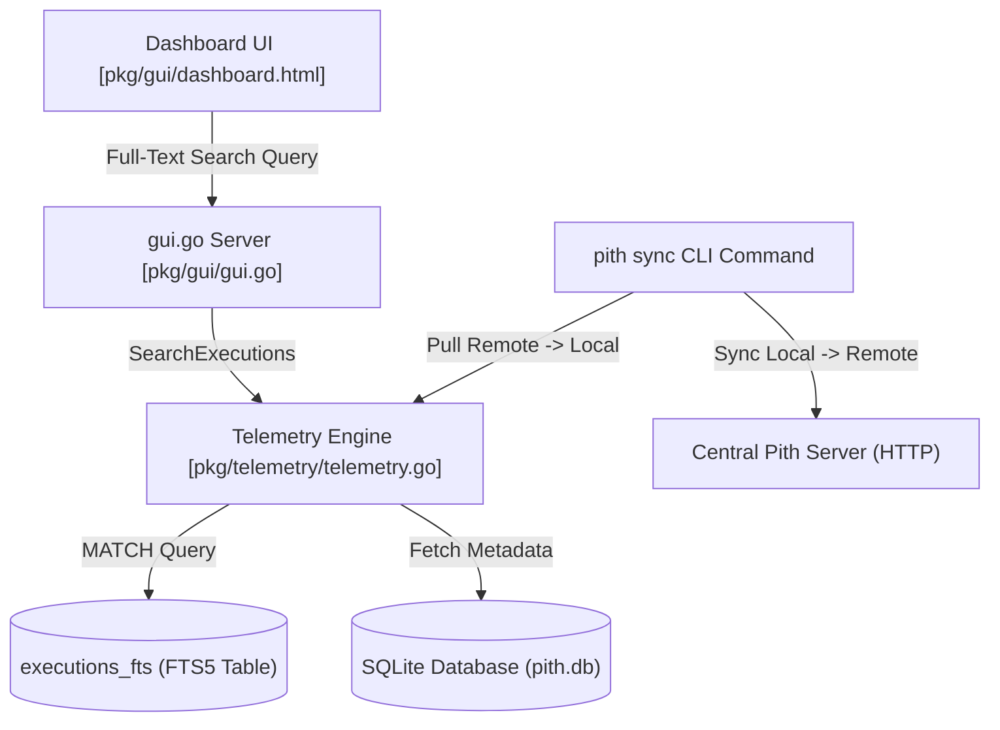

# Tech Plan - Pith Phase 3: Advanced Optimization (FTS5 Search & Telemetry Sync)

Implement **Multi-Agent Sync** (shared telemetry across machines/users) and **Deep-Dive Search** (full-text search over command executions in the dashboard) for Pith.

---

## Proposed Architecture

---

## Proposed Changes

### Pith Core & CLI

#### [NEW] [035-phase3-telemetry-search.md](file:///E:/Repos/Pith/docs/techPlans/035-phase3-telemetry-search.md)
Architectural plan and schema design for FTS5 full-text search and HTTP-based push/pull sync.

#### [MODIFY] [config.go](file:///E:/Repos/Pith/pkg/config/config.go)
* Add `SyncServerURL` string field to `Config` struct.
* Default value set to `http://localhost:8080` (or custom enterprise hub URL).

#### [MODIFY] [telemetry.go](file:///E:/Repos/Pith/pkg/telemetry/telemetry.go)
* **FTS5 Integration:**
  * Define `executions_fts` using `FTS5` virtual table with fields: `command`, `original_content`, `compressed_content`.
  * Implement triggers `executions_ai` (after insert), `executions_ad` (after delete), `executions_au` (after update) to keep the FTS5 index in perfect sync.
  * Overhaul `SearchExecutions` to use SQLite `MATCH` operations on `executions_fts` joined with `executions` on `id = rowid`.
* **JSONL Streaming:**
  * Implement `ExportJSONL(w io.Writer) error`: Stream all database execution records into JSONL format.
  * Implement `ImportJSONL(r io.Reader) error`: Parse a stream of JSONL records and atomically merge them using an upsert transaction (handling uniqueness via a `(timestamp, command, duration_ms)` unique index key).

#### [MODIFY] [gui.go](file:///E:/Repos/Pith/pkg/gui/gui.go)
* **Sync API Handlers:**
  * `/api/telemetry/push` [POST]: Accepts a batch of execution records (JSON array or stream) and saves them in the database.
  * `/api/telemetry/pull` [GET]: Takes a `since_id` query param and returns all execution records newer than the requested ID.

#### [MODIFY] [main.go](file:///E:/Repos/Pith/main.go)
* Add `pith sync` subcommand:
  * Performs dual push/pull synchronization between the local SQLite database and the `SyncServerURL` using the new HTTP endpoints.
  * Adds `--export <path>` and `--import <path>` CLI flags to allow offline JSONL telemetry backups and manual sharing.

#### [MODIFY] [dashboard.html](file:///E:/Repos/Pith/pkg/gui/dashboard.html)
* **Full-Text Search UI:**
  * Redesign the Search bar to support deep-dive queries, showing match previews and token-savings breakdown.
  * Add visual indication of active filters (sources, commands, time-ranges).
* **Telemetry Sync Controls:**
  * Add a sync status indicator and a manual "Sync Telemetry" button connected to `/api/telemetry/push` and `/api/telemetry/pull` mechanisms.

---

## Open Questions

> [!IMPORTANT]
> **1. Deduplication Strategy:**
> When syncing records across multiple developers or sessions, what is the best uniqueness metric to avoid record duplication?
> * **Option A (Recommended):** Add a unique index on `(timestamp, command, duration_ms)`. Any records sharing these fields are skipped or updated.
> * **Option B:** Introduce a random UUID field `record_uuid` to every execution record generated at run-time.
>
> **2. Sync Push Authorization:**
> Do we need basic authentication or API key checks on the central `/api/telemetry/push` endpoint to prevent rogue clients from polluting the central SQLite telemetry?
> * **Option A (Recommended):** Support an optional HTTP header `X-Pith-Token` configured in `config.json`.

---

## Verification Plan

### Automated Tests
* `go test ./pkg/telemetry/...` - Verify FTS5 triggers and search match results, and test JSONL import/export capabilities.
* `go test ./pkg/gui/...` - Verify HTTP push/pull JSON payload responses.

### Manual Verification
* Run local Pith server and trigger `pith sync` from another context, confirming execution records are seamlessly merged.
* Test full-text search operators in the dashboard UI (`*`, `AND`, `OR`) and confirm instant rendering.
