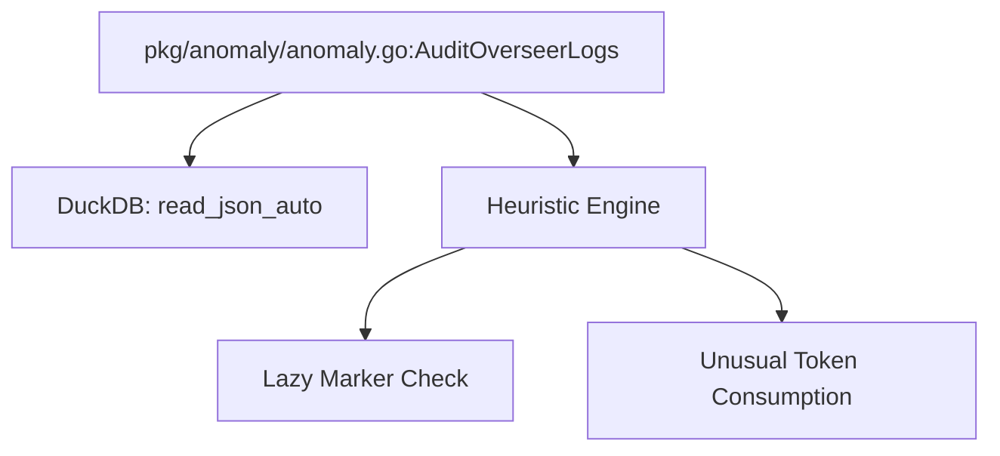

# anomaly package

The `anomaly` package provides logic for detecting behavioral and economic anomalies in LLM interactions. It bridges Pith with Overseer's telemetry stream to identify hallucinations and low-quality responses.

## Architecture

