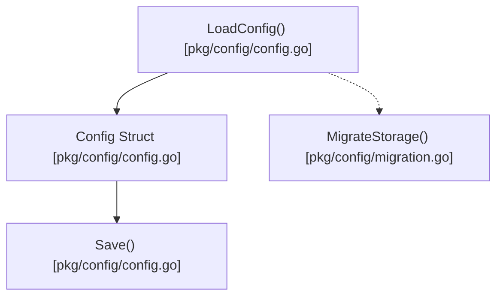

# config

This package handles Pith's configuration, including enabled parsers, truncation settings, and storage locations.




## Architecture

<!-- mermaid-start -->
```mermaid
graph TD
    e__repos_pith_pkg_config_readme_md["[MODULE] /repos/pith/pkg/config/readme.md [readme.md]"]
    e__repos_pith_pkg_config_config_go["[MODULE] /repos/pith/pkg/config/config.go [config.go]"]
    e__repos_pith_pkg_config_config_go_save["[FUNCTION] save [config.go]"]
    e__repos_pith_pkg_config_config_go_interactiveconfig["[FUNCTION] interactiveconfig [config.go]"]
    e__repos_pith_pkg_config_config_go_config["[STRUCT] config [config.go]"]
    e__repos_pith_pkg_config_config_go_getconfigpath["[FUNCTION] getconfigpath [config.go]"]
    e__repos_pith_pkg_config_config_go_loadconfig["[FUNCTION] loadconfig [config.go]"]
    e__repos_pith_pkg_config_config_test_go["[MODULE] /repos/pith/pkg/config/config_test.go [config_test.go]"]
    e__repos_pith_pkg_config_config_test_go_testconfig["[FUNCTION] testconfig [config_test.go]"]
    e__repos_pith_pkg_config_config_test_go_testloadconfiglogic["[FUNCTION] testloadconfiglogic [config_test.go]"]
    e__repos_pith_pkg_config_config_test_go_testconfigsaveload["[FUNCTION] testconfigsaveload [config_test.go]"]
    e__repos_pith_pkg_config_migration_go["[MODULE] /repos/pith/pkg/config/migration.go [migration.go]"]
    e__repos_pith_pkg_config_migration_go_migratestorage["[FUNCTION] migratestorage [migration.go]"]
    e__repos_pith_pkg_config_migration_go_copyfile["[FUNCTION] copyfile [migration.go]"]
    encoding_json[["[EXTERNAL] json"]]
    e__repos_pith_pkg_config_config_go -.->|imports|  encoding_json
    fmt[["[EXTERNAL] fmt"]]
    e__repos_pith_pkg_config_config_go -.->|imports|  fmt
    os[["[EXTERNAL] os"]]
    e__repos_pith_pkg_config_config_go -.->|imports|  os
    path_filepath[["[EXTERNAL] filepath"]]
    e__repos_pith_pkg_config_config_go -.->|imports|  path_filepath
    sort[["[EXTERNAL] sort"]]
    e__repos_pith_pkg_config_config_go -.->|imports|  sort
    strings[["[EXTERNAL] strings"]]
    e__repos_pith_pkg_config_config_go -.->|imports|  strings
    github_com_alecaivazis_survey_v2[["[EXTERNAL] v2"]]
    e__repos_pith_pkg_config_config_go -.->|imports|  github_com_alecaivazis_survey_v2
    join[["[EXTERNAL] join"]]
    e__repos_pith_pkg_config_config_go_getconfigpath -->|calls| join
    filepath_join[["[EXTERNAL] filepath.join"]]
    e__repos_pith_pkg_config_config_go_getconfigpath -->|calls| filepath_join
    stat[["[EXTERNAL] stat"]]
    e__repos_pith_pkg_config_config_go_getconfigpath -->|calls| stat
    os_stat[["[EXTERNAL] os.stat"]]
    e__repos_pith_pkg_config_config_go_getconfigpath -->|calls| os_stat
    getenv[["[EXTERNAL] getenv"]]
    e__repos_pith_pkg_config_config_go_getconfigpath -->|calls| getenv
    os_getenv[["[EXTERNAL] os.getenv"]]
    e__repos_pith_pkg_config_config_go_getconfigpath -->|calls| os_getenv
    userhomedir[["[EXTERNAL] userhomedir"]]
    e__repos_pith_pkg_config_config_go_getconfigpath -->|calls| userhomedir
    os_userhomedir[["[EXTERNAL] os.userhomedir"]]
    e__repos_pith_pkg_config_config_go_getconfigpath -->|calls| os_userhomedir
    getconfigpath[["[EXTERNAL] getconfigpath"]]
    e__repos_pith_pkg_config_config_go_loadconfig -->|calls| getconfigpath
    make[["[EXTERNAL] make"]]
    e__repos_pith_pkg_config_config_go_loadconfig -->|calls| make
    dir[["[EXTERNAL] dir"]]
    e__repos_pith_pkg_config_config_go_loadconfig -->|calls| dir
    filepath_dir[["[EXTERNAL] filepath.dir"]]
    e__repos_pith_pkg_config_config_go_loadconfig -->|calls| filepath_dir
    e__repos_pith_pkg_config_config_go_loadconfig -->|calls| join
    e__repos_pith_pkg_config_config_go_loadconfig -->|calls| filepath_join
    e__repos_pith_pkg_config_config_go_loadconfig -->|calls| getenv
    e__repos_pith_pkg_config_config_go_loadconfig -->|calls| os_getenv
    e__repos_pith_pkg_config_config_go_loadconfig -->|calls| stat
    e__repos_pith_pkg_config_config_go_loadconfig -->|calls| os_stat
    contains[["[EXTERNAL] contains"]]
    e__repos_pith_pkg_config_config_go_loadconfig -->|calls| contains
    strings_contains[["[EXTERNAL] strings.contains"]]
    e__repos_pith_pkg_config_config_go_loadconfig -->|calls| strings_contains
    readfile[["[EXTERNAL] readfile"]]
    e__repos_pith_pkg_config_config_go_loadconfig -->|calls| readfile
    os_readfile[["[EXTERNAL] os.readfile"]]
    e__repos_pith_pkg_config_config_go_loadconfig -->|calls| os_readfile
    isnotexist[["[EXTERNAL] isnotexist"]]
    e__repos_pith_pkg_config_config_go_loadconfig -->|calls| isnotexist
    os_isnotexist[["[EXTERNAL] os.isnotexist"]]
    e__repos_pith_pkg_config_config_go_loadconfig -->|calls| os_isnotexist
    unmarshal[["[EXTERNAL] unmarshal"]]
    e__repos_pith_pkg_config_config_go_loadconfig -->|calls| unmarshal
    json_unmarshal[["[EXTERNAL] json.unmarshal"]]
    e__repos_pith_pkg_config_config_go_loadconfig -->|calls| json_unmarshal
    e__repos_pith_pkg_config_config_go_save -->|calls| getconfigpath
    marshalindent[["[EXTERNAL] marshalindent"]]
    e__repos_pith_pkg_config_config_go_save -->|calls| marshalindent
    json_marshalindent[["[EXTERNAL] json.marshalindent"]]
    e__repos_pith_pkg_config_config_go_save -->|calls| json_marshalindent
    writefile[["[EXTERNAL] writefile"]]
    e__repos_pith_pkg_config_config_go_save -->|calls| writefile
    os_writefile[["[EXTERNAL] os.writefile"]]
    e__repos_pith_pkg_config_config_go_save -->|calls| os_writefile
    e__repos_pith_pkg_config_config_go_interactiveconfig -->|calls| strings
    sort_strings[["[EXTERNAL] sort.strings"]]
    e__repos_pith_pkg_config_config_go_interactiveconfig -->|calls| sort_strings
    append[["[EXTERNAL] append"]]
    e__repos_pith_pkg_config_config_go_interactiveconfig -->|calls| append
    askone[["[EXTERNAL] askone"]]
    e__repos_pith_pkg_config_config_go_interactiveconfig -->|calls| askone
    survey_askone[["[EXTERNAL] survey.askone"]]
    e__repos_pith_pkg_config_config_go_interactiveconfig -->|calls| survey_askone
    e__repos_pith_pkg_config_config_go_interactiveconfig -->|calls| make
    sprintf[["[EXTERNAL] sprintf"]]
    e__repos_pith_pkg_config_config_go_interactiveconfig -->|calls| sprintf
    fmt_sprintf[["[EXTERNAL] fmt.sprintf"]]
    e__repos_pith_pkg_config_config_go_interactiveconfig -->|calls| fmt_sprintf
    ask[["[EXTERNAL] ask"]]
    e__repos_pith_pkg_config_config_go_interactiveconfig -->|calls| ask
    survey_ask[["[EXTERNAL] survey.ask"]]
    e__repos_pith_pkg_config_config_go_interactiveconfig -->|calls| survey_ask
    save[["[EXTERNAL] save"]]
    e__repos_pith_pkg_config_config_go_interactiveconfig -->|calls| save
    c_save[["[EXTERNAL] c.save"]]
    e__repos_pith_pkg_config_config_go_interactiveconfig -->|calls| c_save
    e__repos_pith_pkg_config_config_go ==>|contains| e__repos_pith_pkg_config_config_go_save
    e__repos_pith_pkg_config_config_go ==>|contains| e__repos_pith_pkg_config_config_go_interactiveconfig
    e__repos_pith_pkg_config_config_go ==>|contains| e__repos_pith_pkg_config_config_go_config
    e__repos_pith_pkg_config_config_go ==>|contains| e__repos_pith_pkg_config_config_go_getconfigpath
    e__repos_pith_pkg_config_config_go ==>|contains| e__repos_pith_pkg_config_config_go_loadconfig
    e__repos_pith_pkg_config_config_test_go -.->|imports|  encoding_json
    e__repos_pith_pkg_config_config_test_go -.->|imports|  os
    testing[["[EXTERNAL] testing"]]
    e__repos_pith_pkg_config_config_test_go -.->|imports|  testing
    mkdirtemp[["[EXTERNAL] mkdirtemp"]]
    e__repos_pith_pkg_config_config_test_go_testconfig -->|calls| mkdirtemp
    os_mkdirtemp[["[EXTERNAL] os.mkdirtemp"]]
    e__repos_pith_pkg_config_config_test_go_testconfig -->|calls| os_mkdirtemp
    fatal[["[EXTERNAL] fatal"]]
    e__repos_pith_pkg_config_config_test_go_testconfig -->|calls| fatal
    t_fatal[["[EXTERNAL] t.fatal"]]
    e__repos_pith_pkg_config_config_test_go_testconfig -->|calls| t_fatal
    removeall[["[EXTERNAL] removeall"]]
    e__repos_pith_pkg_config_config_test_go_testconfig -->|calls| removeall
    os_removeall[["[EXTERNAL] os.removeall"]]
    e__repos_pith_pkg_config_config_test_go_testconfig -->|calls| os_removeall
    e__repos_pith_pkg_config_config_test_go_testloadconfiglogic -->|calls| make
    e__repos_pith_pkg_config_config_test_go_testloadconfiglogic -->|calls| unmarshal
    e__repos_pith_pkg_config_config_test_go_testloadconfiglogic -->|calls| json_unmarshal
    e__repos_pith_pkg_config_config_test_go_testloadconfiglogic -->|calls| fatal
    e__repos_pith_pkg_config_config_test_go_testloadconfiglogic -->|calls| t_fatal
    error[["[EXTERNAL] error"]]
    e__repos_pith_pkg_config_config_test_go_testloadconfiglogic -->|calls| error
    t_error[["[EXTERNAL] t.error"]]
    e__repos_pith_pkg_config_config_test_go_testloadconfiglogic -->|calls| t_error
    createtemp[["[EXTERNAL] createtemp"]]
    e__repos_pith_pkg_config_config_test_go_testconfigsaveload -->|calls| createtemp
    os_createtemp[["[EXTERNAL] os.createtemp"]]
    e__repos_pith_pkg_config_config_test_go_testconfigsaveload -->|calls| os_createtemp
    e__repos_pith_pkg_config_config_test_go_testconfigsaveload -->|calls| fatal
    e__repos_pith_pkg_config_config_test_go_testconfigsaveload -->|calls| t_fatal
    remove[["[EXTERNAL] remove"]]
    e__repos_pith_pkg_config_config_test_go_testconfigsaveload -->|calls| remove
    os_remove[["[EXTERNAL] os.remove"]]
    e__repos_pith_pkg_config_config_test_go_testconfigsaveload -->|calls| os_remove
    name[["[EXTERNAL] name"]]
    e__repos_pith_pkg_config_config_test_go_testconfigsaveload -->|calls| name
    tmpfile_name[["[EXTERNAL] tmpfile.name"]]
    e__repos_pith_pkg_config_config_test_go_testconfigsaveload -->|calls| tmpfile_name
    marshal[["[EXTERNAL] marshal"]]
    e__repos_pith_pkg_config_config_test_go_testconfigsaveload -->|calls| marshal
    json_marshal[["[EXTERNAL] json.marshal"]]
    e__repos_pith_pkg_config_config_test_go_testconfigsaveload -->|calls| json_marshal
    e__repos_pith_pkg_config_config_test_go_testconfigsaveload -->|calls| writefile
    e__repos_pith_pkg_config_config_test_go_testconfigsaveload -->|calls| os_writefile
    e__repos_pith_pkg_config_config_test_go_testconfigsaveload -->|calls| readfile
    e__repos_pith_pkg_config_config_test_go_testconfigsaveload -->|calls| os_readfile
    e__repos_pith_pkg_config_config_test_go_testconfigsaveload -->|calls| unmarshal
    e__repos_pith_pkg_config_config_test_go_testconfigsaveload -->|calls| json_unmarshal
    e__repos_pith_pkg_config_config_test_go_testconfigsaveload -->|calls| error
    e__repos_pith_pkg_config_config_test_go_testconfigsaveload -->|calls| t_error
    e__repos_pith_pkg_config_config_test_go ==>|contains| e__repos_pith_pkg_config_config_test_go_testconfig
    e__repos_pith_pkg_config_config_test_go ==>|contains| e__repos_pith_pkg_config_config_test_go_testloadconfiglogic
    e__repos_pith_pkg_config_config_test_go ==>|contains| e__repos_pith_pkg_config_config_test_go_testconfigsaveload
    e__repos_pith_pkg_config_migration_go -.->|imports|  fmt
    io[["[EXTERNAL] io"]]
    e__repos_pith_pkg_config_migration_go -.->|imports|  io
    e__repos_pith_pkg_config_migration_go -.->|imports|  os
    e__repos_pith_pkg_config_migration_go -.->|imports|  path_filepath
    e__repos_pith_pkg_config_migration_go_migratestorage -->|calls| userhomedir
    e__repos_pith_pkg_config_migration_go_migratestorage -->|calls| os_userhomedir
    e__repos_pith_pkg_config_migration_go_migratestorage -->|calls| join
    e__repos_pith_pkg_config_migration_go_migratestorage -->|calls| filepath_join
    e__repos_pith_pkg_config_migration_go_migratestorage -->|calls| stat
    e__repos_pith_pkg_config_migration_go_migratestorage -->|calls| os_stat
    e__repos_pith_pkg_config_migration_go_migratestorage -->|calls| isnotexist
    e__repos_pith_pkg_config_migration_go_migratestorage -->|calls| os_isnotexist
    mkdirall[["[EXTERNAL] mkdirall"]]
    e__repos_pith_pkg_config_migration_go_migratestorage -->|calls| mkdirall
    os_mkdirall[["[EXTERNAL] os.mkdirall"]]
    e__repos_pith_pkg_config_migration_go_migratestorage -->|calls| os_mkdirall
    printf[["[EXTERNAL] printf"]]
    e__repos_pith_pkg_config_migration_go_migratestorage -->|calls| printf
    fmt_printf[["[EXTERNAL] fmt.printf"]]
    e__repos_pith_pkg_config_migration_go_migratestorage -->|calls| fmt_printf
    copyfile[["[EXTERNAL] copyfile"]]
    e__repos_pith_pkg_config_migration_go_migratestorage -->|calls| copyfile
    errorf[["[EXTERNAL] errorf"]]
    e__repos_pith_pkg_config_migration_go_migratestorage -->|calls| errorf
    fmt_errorf[["[EXTERNAL] fmt.errorf"]]
    e__repos_pith_pkg_config_migration_go_migratestorage -->|calls| fmt_errorf
    rename[["[EXTERNAL] rename"]]
    e__repos_pith_pkg_config_migration_go_migratestorage -->|calls| rename
    os_rename[["[EXTERNAL] os.rename"]]
    e__repos_pith_pkg_config_migration_go_migratestorage -->|calls| os_rename
    open[["[EXTERNAL] open"]]
    e__repos_pith_pkg_config_migration_go_copyfile -->|calls| open
    os_open[["[EXTERNAL] os.open"]]
    e__repos_pith_pkg_config_migration_go_copyfile -->|calls| os_open
    close[["[EXTERNAL] close"]]
    e__repos_pith_pkg_config_migration_go_copyfile -->|calls| close
    sourcefile_close[["[EXTERNAL] sourcefile.close"]]
    e__repos_pith_pkg_config_migration_go_copyfile -->|calls| sourcefile_close
    create[["[EXTERNAL] create"]]
    e__repos_pith_pkg_config_migration_go_copyfile -->|calls| create
    os_create[["[EXTERNAL] os.create"]]
    e__repos_pith_pkg_config_migration_go_copyfile -->|calls| os_create
    destfile_close[["[EXTERNAL] destfile.close"]]
    e__repos_pith_pkg_config_migration_go_copyfile -->|calls| destfile_close
    copy[["[EXTERNAL] copy"]]
    e__repos_pith_pkg_config_migration_go_copyfile -->|calls| copy
    io_copy[["[EXTERNAL] io.copy"]]
    e__repos_pith_pkg_config_migration_go_copyfile -->|calls| io_copy
    e__repos_pith_pkg_config_migration_go ==>|contains| e__repos_pith_pkg_config_migration_go_migratestorage
    e__repos_pith_pkg_config_migration_go ==>|contains| e__repos_pith_pkg_config_migration_go_copyfile
```
<!-- mermaid-end -->
