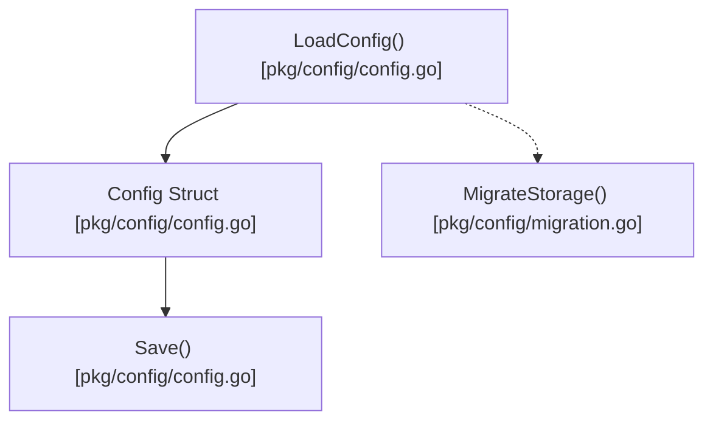

# config

This package handles Pith's configuration, including enabled parsers, truncation settings, and storage locations.

```mermaid
graph TD
    ConfigStruct["Config Struct [pkg/config/config.go]"]
    LoadConfig["LoadConfig() [pkg/config/config.go]"]
    Save["Save() [pkg/config/config.go]"]
    Migrate["MigrateStorage() [pkg/config/migration.go]"]
    
    LoadConfig --> ConfigStruct
    ConfigStruct --> Save
    LoadConfig -.-> Migrate
```
