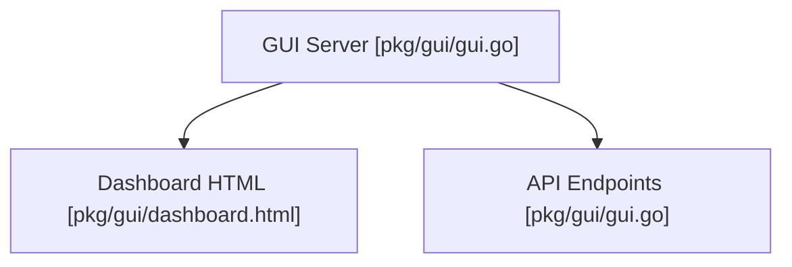

# gui

This package provides the web-based analytics dashboard for visualizing token savings and command discovery.




## Architecture

<!-- mermaid-start -->
```mermaid
graph TD
    e__repos_pith_pkg_gui_readme_md["[MODULE] /repos/pith/pkg/gui/readme.md [readme.md]"]
    e__repos_pith_pkg_gui_gui_go["[MODULE] /repos/pith/pkg/gui/gui.go [gui.go]"]
    e__repos_pith_pkg_gui_gui_go_route_get_id["[ROUTE] id [gui.go]"]
    e__repos_pith_pkg_gui_gui_go_openbrowser["[FUNCTION] openbrowser [gui.go]"]
    e__repos_pith_pkg_gui_gui_go_startdashboard["[FUNCTION] startdashboard [gui.go]"]
    e__repos_pith_pkg_gui_gui_go_route_get_source["[ROUTE] source [gui.go]"]
    pith_pkg_telemetry[["[EXTERNAL] telemetry"]]
    e__repos_pith_pkg_gui_gui_go -.->|imports|  pith_pkg_telemetry
    embed[["[EXTERNAL] embed"]]
    e__repos_pith_pkg_gui_gui_go -.->|imports|  embed
    encoding_json[["[EXTERNAL] json"]]
    e__repos_pith_pkg_gui_gui_go -.->|imports|  encoding_json
    fmt[["[EXTERNAL] fmt"]]
    e__repos_pith_pkg_gui_gui_go -.->|imports|  fmt
    net_http[["[EXTERNAL] http"]]
    e__repos_pith_pkg_gui_gui_go -.->|imports|  net_http
    os_exec[["[EXTERNAL] exec"]]
    e__repos_pith_pkg_gui_gui_go -.->|imports|  os_exec
    runtime[["[EXTERNAL] runtime"]]
    e__repos_pith_pkg_gui_gui_go -.->|imports|  runtime
    handlefunc[["[EXTERNAL] handlefunc"]]
    e__repos_pith_pkg_gui_gui_go_startdashboard -->|calls| handlefunc
    http_handlefunc[["[EXTERNAL] http.handlefunc"]]
    e__repos_pith_pkg_gui_gui_go_startdashboard -->|calls| http_handlefunc
    readfile[["[EXTERNAL] readfile"]]
    e__repos_pith_pkg_gui_gui_go_startdashboard -->|calls| readfile
    staticfiles_readfile[["[EXTERNAL] staticfiles.readfile"]]
    e__repos_pith_pkg_gui_gui_go_startdashboard -->|calls| staticfiles_readfile
    error[["[EXTERNAL] error"]]
    e__repos_pith_pkg_gui_gui_go_startdashboard -->|calls| error
    http_error[["[EXTERNAL] http.error"]]
    e__repos_pith_pkg_gui_gui_go_startdashboard -->|calls| http_error
    header[["[EXTERNAL] header"]]
    e__repos_pith_pkg_gui_gui_go_startdashboard -->|calls| header
    w_header[["[EXTERNAL] w.header"]]
    e__repos_pith_pkg_gui_gui_go_startdashboard -->|calls| w_header
    set[["[EXTERNAL] set"]]
    e__repos_pith_pkg_gui_gui_go_startdashboard -->|calls| set
    write[["[EXTERNAL] write"]]
    e__repos_pith_pkg_gui_gui_go_startdashboard -->|calls| write
    w_write[["[EXTERNAL] w.write"]]
    e__repos_pith_pkg_gui_gui_go_startdashboard -->|calls| w_write
    query[["[EXTERNAL] query"]]
    e__repos_pith_pkg_gui_gui_go_route_get_source -->|calls| query
    get[["[EXTERNAL] get"]]
    e__repos_pith_pkg_gui_gui_go_startdashboard -->|calls| get
    getstats[["[EXTERNAL] getstats"]]
    e__repos_pith_pkg_gui_gui_go_startdashboard -->|calls| getstats
    tel_getstats[["[EXTERNAL] tel.getstats"]]
    e__repos_pith_pkg_gui_gui_go_startdashboard -->|calls| tel_getstats
    getstatsbycommand[["[EXTERNAL] getstatsbycommand"]]
    e__repos_pith_pkg_gui_gui_go_startdashboard -->|calls| getstatsbycommand
    tel_getstatsbycommand[["[EXTERNAL] tel.getstatsbycommand"]]
    e__repos_pith_pkg_gui_gui_go_startdashboard -->|calls| tel_getstatsbycommand
    getstatsbyday[["[EXTERNAL] getstatsbyday"]]
    e__repos_pith_pkg_gui_gui_go_startdashboard -->|calls| getstatsbyday
    tel_getstatsbyday[["[EXTERNAL] tel.getstatsbyday"]]
    e__repos_pith_pkg_gui_gui_go_startdashboard -->|calls| tel_getstatsbyday
    newencoder[["[EXTERNAL] newencoder"]]
    e__repos_pith_pkg_gui_gui_go_startdashboard -->|calls| newencoder
    json_newencoder[["[EXTERNAL] json.newencoder"]]
    e__repos_pith_pkg_gui_gui_go_startdashboard -->|calls| json_newencoder
    encode[["[EXTERNAL] encode"]]
    e__repos_pith_pkg_gui_gui_go_startdashboard -->|calls| encode
    getunparsedcommands[["[EXTERNAL] getunparsedcommands"]]
    e__repos_pith_pkg_gui_gui_go_startdashboard -->|calls| getunparsedcommands
    tel_getunparsedcommands[["[EXTERNAL] tel.getunparsedcommands"]]
    e__repos_pith_pkg_gui_gui_go_startdashboard -->|calls| tel_getunparsedcommands
    getrecentexecutions[["[EXTERNAL] getrecentexecutions"]]
    e__repos_pith_pkg_gui_gui_go_startdashboard -->|calls| getrecentexecutions
    tel_getrecentexecutions[["[EXTERNAL] tel.getrecentexecutions"]]
    e__repos_pith_pkg_gui_gui_go_startdashboard -->|calls| tel_getrecentexecutions
    e__repos_pith_pkg_gui_gui_go_route_get_id -->|calls| query
    sscanf[["[EXTERNAL] sscanf"]]
    e__repos_pith_pkg_gui_gui_go_startdashboard -->|calls| sscanf
    fmt_sscanf[["[EXTERNAL] fmt.sscanf"]]
    e__repos_pith_pkg_gui_gui_go_startdashboard -->|calls| fmt_sscanf
    getexecutiondetails[["[EXTERNAL] getexecutiondetails"]]
    e__repos_pith_pkg_gui_gui_go_startdashboard -->|calls| getexecutiondetails
    tel_getexecutiondetails[["[EXTERNAL] tel.getexecutiondetails"]]
    e__repos_pith_pkg_gui_gui_go_startdashboard -->|calls| tel_getexecutiondetails
    getsources[["[EXTERNAL] getsources"]]
    e__repos_pith_pkg_gui_gui_go_startdashboard -->|calls| getsources
    tel_getsources[["[EXTERNAL] tel.getsources"]]
    e__repos_pith_pkg_gui_gui_go_startdashboard -->|calls| tel_getsources
    sprintf[["[EXTERNAL] sprintf"]]
    e__repos_pith_pkg_gui_gui_go_startdashboard -->|calls| sprintf
    fmt_sprintf[["[EXTERNAL] fmt.sprintf"]]
    e__repos_pith_pkg_gui_gui_go_startdashboard -->|calls| fmt_sprintf
    printf[["[EXTERNAL] printf"]]
    e__repos_pith_pkg_gui_gui_go_startdashboard -->|calls| printf
    fmt_printf[["[EXTERNAL] fmt.printf"]]
    e__repos_pith_pkg_gui_gui_go_startdashboard -->|calls| fmt_printf
    openbrowser[["[EXTERNAL] openbrowser"]]
    e__repos_pith_pkg_gui_gui_go_startdashboard -->|calls| openbrowser
    listenandserve[["[EXTERNAL] listenandserve"]]
    e__repos_pith_pkg_gui_gui_go_startdashboard -->|calls| listenandserve
    http_listenandserve[["[EXTERNAL] http.listenandserve"]]
    e__repos_pith_pkg_gui_gui_go_startdashboard -->|calls| http_listenandserve
    command[["[EXTERNAL] command"]]
    e__repos_pith_pkg_gui_gui_go_openbrowser -->|calls| command
    exec_command[["[EXTERNAL] exec.command"]]
    e__repos_pith_pkg_gui_gui_go_openbrowser -->|calls| exec_command
    start[["[EXTERNAL] start"]]
    e__repos_pith_pkg_gui_gui_go_openbrowser -->|calls| start
    errorf[["[EXTERNAL] errorf"]]
    e__repos_pith_pkg_gui_gui_go_openbrowser -->|calls| errorf
    fmt_errorf[["[EXTERNAL] fmt.errorf"]]
    e__repos_pith_pkg_gui_gui_go_openbrowser -->|calls| fmt_errorf
    e__repos_pith_pkg_gui_gui_go_openbrowser -->|calls| printf
    e__repos_pith_pkg_gui_gui_go_openbrowser -->|calls| fmt_printf
    e__repos_pith_pkg_gui_gui_go ==>|contains| e__repos_pith_pkg_gui_gui_go_route_get_id
    e__repos_pith_pkg_gui_gui_go ==>|contains| e__repos_pith_pkg_gui_gui_go_openbrowser
    e__repos_pith_pkg_gui_gui_go ==>|contains| e__repos_pith_pkg_gui_gui_go_startdashboard
    e__repos_pith_pkg_gui_gui_go ==>|contains| e__repos_pith_pkg_gui_gui_go_route_get_source
```
<!-- mermaid-end -->
