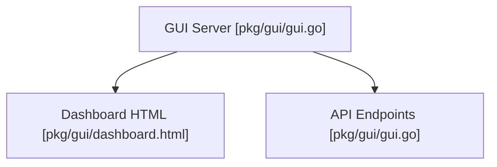

# gui

This package provides the web-based analytics dashboard for visualizing token savings and command discovery.

```mermaid
graph TD
    Dashboard["Dashboard HTML [pkg/gui/dashboard.html]"]
    Server["GUI Server [pkg/gui/gui.go]"]
    API["API Endpoints [pkg/gui/gui.go]"]
    
    Server --> Dashboard
    Server --> API
```
