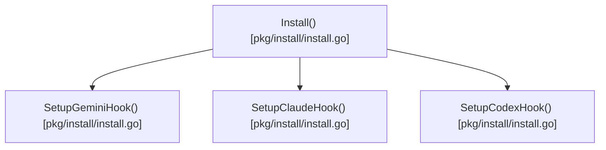

# install

This package handles the installation of Pith to the system PATH and the injection of hooks into AI agent CLI settings.




## Architecture

<!-- mermaid-start -->
```mermaid
graph TD
    e__repos_pith_pkg_install_readme_md["[MODULE] /repos/pith/pkg/install/readme.md [readme.md]"]
    e__repos_pith_pkg_install_install_go["[MODULE] /repos/pith/pkg/install/install.go [install.go]"]
    e__repos_pith_pkg_install_install_go_installwindows["[FUNCTION] installwindows [install.go]"]
    e__repos_pith_pkg_install_install_go_setuphook["[FUNCTION] setuphook [install.go]"]
    e__repos_pith_pkg_install_install_go_setupcodexhook["[FUNCTION] setupcodexhook [install.go]"]
    e__repos_pith_pkg_install_install_go_hookentry["[STRUCT] hookentry [install.go]"]
    e__repos_pith_pkg_install_install_go_hookgroup["[STRUCT] hookgroup [install.go]"]
    e__repos_pith_pkg_install_install_go_settings["[STRUCT] settings [install.go]"]
    e__repos_pith_pkg_install_install_go_unmarshaljson["[FUNCTION] unmarshaljson [install.go]"]
    e__repos_pith_pkg_install_install_go_marshaljson["[FUNCTION] marshaljson [install.go]"]
    e__repos_pith_pkg_install_install_go_setupgeminihook["[FUNCTION] setupgeminihook [install.go]"]
    e__repos_pith_pkg_install_install_go_setupclaudehook["[FUNCTION] setupclaudehook [install.go]"]
    e__repos_pith_pkg_install_install_go_install["[FUNCTION] install [install.go]"]
    e__repos_pith_pkg_install_install_test_go["[MODULE] /repos/pith/pkg/install/install_test.go [install_test.go]"]
    e__repos_pith_pkg_install_install_test_go_testsetuphooks["[FUNCTION] testsetuphooks [install_test.go]"]
    encoding_json[["[EXTERNAL] json"]]
    e__repos_pith_pkg_install_install_go -.->|imports|  encoding_json
    fmt[["[EXTERNAL] fmt"]]
    e__repos_pith_pkg_install_install_go -.->|imports|  fmt
    os[["[EXTERNAL] os"]]
    e__repos_pith_pkg_install_install_go -.->|imports|  os
    os_exec[["[EXTERNAL] exec"]]
    e__repos_pith_pkg_install_install_go -.->|imports|  os_exec
    path_filepath[["[EXTERNAL] filepath"]]
    e__repos_pith_pkg_install_install_go -.->|imports|  path_filepath
    runtime[["[EXTERNAL] runtime"]]
    e__repos_pith_pkg_install_install_go -.->|imports|  runtime
    strings[["[EXTERNAL] strings"]]
    e__repos_pith_pkg_install_install_go -.->|imports|  strings
    userhomedir[["[EXTERNAL] userhomedir"]]
    e__repos_pith_pkg_install_install_go_install -->|calls| userhomedir
    os_userhomedir[["[EXTERNAL] os.userhomedir"]]
    e__repos_pith_pkg_install_install_go_install -->|calls| os_userhomedir
    join[["[EXTERNAL] join"]]
    e__repos_pith_pkg_install_install_go_install -->|calls| join
    filepath_join[["[EXTERNAL] filepath.join"]]
    e__repos_pith_pkg_install_install_go_install -->|calls| filepath_join
    mkdirall[["[EXTERNAL] mkdirall"]]
    e__repos_pith_pkg_install_install_go_install -->|calls| mkdirall
    os_mkdirall[["[EXTERNAL] os.mkdirall"]]
    e__repos_pith_pkg_install_install_go_install -->|calls| os_mkdirall
    errorf[["[EXTERNAL] errorf"]]
    e__repos_pith_pkg_install_install_go_install -->|calls| errorf
    fmt_errorf[["[EXTERNAL] fmt.errorf"]]
    e__repos_pith_pkg_install_install_go_install -->|calls| fmt_errorf
    executable[["[EXTERNAL] executable"]]
    e__repos_pith_pkg_install_install_go_install -->|calls| executable
    os_executable[["[EXTERNAL] os.executable"]]
    e__repos_pith_pkg_install_install_go_install -->|calls| os_executable
    base[["[EXTERNAL] base"]]
    e__repos_pith_pkg_install_install_go_install -->|calls| base
    filepath_base[["[EXTERNAL] filepath.base"]]
    e__repos_pith_pkg_install_install_go_install -->|calls| filepath_base
    abs[["[EXTERNAL] abs"]]
    e__repos_pith_pkg_install_install_go_install -->|calls| abs
    filepath_abs[["[EXTERNAL] filepath.abs"]]
    e__repos_pith_pkg_install_install_go_install -->|calls| filepath_abs
    equalfold[["[EXTERNAL] equalfold"]]
    e__repos_pith_pkg_install_install_go_install -->|calls| equalfold
    strings_equalfold[["[EXTERNAL] strings.equalfold"]]
    e__repos_pith_pkg_install_install_go_install -->|calls| strings_equalfold
    printf[["[EXTERNAL] printf"]]
    e__repos_pith_pkg_install_install_go_install -->|calls| printf
    fmt_printf[["[EXTERNAL] fmt.printf"]]
    e__repos_pith_pkg_install_install_go_install -->|calls| fmt_printf
    readfile[["[EXTERNAL] readfile"]]
    e__repos_pith_pkg_install_install_go_install -->|calls| readfile
    os_readfile[["[EXTERNAL] os.readfile"]]
    e__repos_pith_pkg_install_install_go_install -->|calls| os_readfile
    writefile[["[EXTERNAL] writefile"]]
    e__repos_pith_pkg_install_install_go_install -->|calls| writefile
    os_writefile[["[EXTERNAL] os.writefile"]]
    e__repos_pith_pkg_install_install_go_install -->|calls| os_writefile
    installwindows[["[EXTERNAL] installwindows"]]
    e__repos_pith_pkg_install_install_go_install -->|calls| installwindows
    command[["[EXTERNAL] command"]]
    e__repos_pith_pkg_install_install_go_installwindows -->|calls| command
    exec_command[["[EXTERNAL] exec.command"]]
    e__repos_pith_pkg_install_install_go_installwindows -->|calls| exec_command
    sprintf[["[EXTERNAL] sprintf"]]
    e__repos_pith_pkg_install_install_go_installwindows -->|calls| sprintf
    fmt_sprintf[["[EXTERNAL] fmt.sprintf"]]
    e__repos_pith_pkg_install_install_go_installwindows -->|calls| fmt_sprintf
    combinedoutput[["[EXTERNAL] combinedoutput"]]
    e__repos_pith_pkg_install_install_go_installwindows -->|calls| combinedoutput
    cmd_combinedoutput[["[EXTERNAL] cmd.combinedoutput"]]
    e__repos_pith_pkg_install_install_go_installwindows -->|calls| cmd_combinedoutput
    e__repos_pith_pkg_install_install_go_installwindows -->|calls| errorf
    e__repos_pith_pkg_install_install_go_installwindows -->|calls| fmt_errorf
    string[["[EXTERNAL] string"]]
    e__repos_pith_pkg_install_install_go_installwindows -->|calls| string
    println[["[EXTERNAL] println"]]
    e__repos_pith_pkg_install_install_go_installwindows -->|calls| println
    fmt_println[["[EXTERNAL] fmt.println"]]
    e__repos_pith_pkg_install_install_go_installwindows -->|calls| fmt_println
    unmarshal[["[EXTERNAL] unmarshal"]]
    e__repos_pith_pkg_install_install_go_unmarshaljson -->|calls| unmarshal
    json_unmarshal[["[EXTERNAL] json.unmarshal"]]
    e__repos_pith_pkg_install_install_go_unmarshaljson -->|calls| json_unmarshal
    delete[["[EXTERNAL] delete"]]
    e__repos_pith_pkg_install_install_go_unmarshaljson -->|calls| delete
    make[["[EXTERNAL] make"]]
    e__repos_pith_pkg_install_install_go_marshaljson -->|calls| make
    marshal[["[EXTERNAL] marshal"]]
    e__repos_pith_pkg_install_install_go_marshaljson -->|calls| marshal
    json_marshal[["[EXTERNAL] json.marshal"]]
    e__repos_pith_pkg_install_install_go_marshaljson -->|calls| json_marshal
    e__repos_pith_pkg_install_install_go_setuphook -->|calls| userhomedir
    e__repos_pith_pkg_install_install_go_setuphook -->|calls| os_userhomedir
    e__repos_pith_pkg_install_install_go_setuphook -->|calls| join
    e__repos_pith_pkg_install_install_go_setuphook -->|calls| filepath_join
    e__repos_pith_pkg_install_install_go_setuphook -->|calls| mkdirall
    e__repos_pith_pkg_install_install_go_setuphook -->|calls| os_mkdirall
    stat[["[EXTERNAL] stat"]]
    e__repos_pith_pkg_install_install_go_setuphook -->|calls| stat
    os_stat[["[EXTERNAL] os.stat"]]
    e__repos_pith_pkg_install_install_go_setuphook -->|calls| os_stat
    e__repos_pith_pkg_install_install_go_setuphook -->|calls| readfile
    e__repos_pith_pkg_install_install_go_setuphook -->|calls| os_readfile
    e__repos_pith_pkg_install_install_go_setuphook -->|calls| writefile
    e__repos_pith_pkg_install_install_go_setuphook -->|calls| os_writefile
    e__repos_pith_pkg_install_install_go_setuphook -->|calls| unmarshal
    e__repos_pith_pkg_install_install_go_setuphook -->|calls| json_unmarshal
    e__repos_pith_pkg_install_install_go_setuphook -->|calls| make
    e__repos_pith_pkg_install_install_go_setuphook -->|calls| sprintf
    e__repos_pith_pkg_install_install_go_setuphook -->|calls| fmt_sprintf
    append[["[EXTERNAL] append"]]
    e__repos_pith_pkg_install_install_go_setuphook -->|calls| append
    marshalindent[["[EXTERNAL] marshalindent"]]
    e__repos_pith_pkg_install_install_go_setuphook -->|calls| marshalindent
    json_marshalindent[["[EXTERNAL] json.marshalindent"]]
    e__repos_pith_pkg_install_install_go_setuphook -->|calls| json_marshalindent
    setuphook[["[EXTERNAL] setuphook"]]
    e__repos_pith_pkg_install_install_go_setupgeminihook -->|calls| setuphook
    e__repos_pith_pkg_install_install_go_setupgeminihook -->|calls| printf
    e__repos_pith_pkg_install_install_go_setupgeminihook -->|calls| fmt_printf
    e__repos_pith_pkg_install_install_go_setupclaudehook -->|calls| setuphook
    e__repos_pith_pkg_install_install_go_setupclaudehook -->|calls| printf
    e__repos_pith_pkg_install_install_go_setupclaudehook -->|calls| fmt_printf
    e__repos_pith_pkg_install_install_go_setupcodexhook -->|calls| setuphook
    e__repos_pith_pkg_install_install_go_setupcodexhook -->|calls| printf
    e__repos_pith_pkg_install_install_go_setupcodexhook -->|calls| fmt_printf
    e__repos_pith_pkg_install_install_go ==>|contains| e__repos_pith_pkg_install_install_go_installwindows
    e__repos_pith_pkg_install_install_go ==>|contains| e__repos_pith_pkg_install_install_go_setuphook
    e__repos_pith_pkg_install_install_go ==>|contains| e__repos_pith_pkg_install_install_go_setupcodexhook
    e__repos_pith_pkg_install_install_go ==>|contains| e__repos_pith_pkg_install_install_go_hookentry
    e__repos_pith_pkg_install_install_go ==>|contains| e__repos_pith_pkg_install_install_go_hookgroup
    e__repos_pith_pkg_install_install_go ==>|contains| e__repos_pith_pkg_install_install_go_settings
    e__repos_pith_pkg_install_install_go ==>|contains| e__repos_pith_pkg_install_install_go_unmarshaljson
    e__repos_pith_pkg_install_install_go ==>|contains| e__repos_pith_pkg_install_install_go_marshaljson
    e__repos_pith_pkg_install_install_go ==>|contains| e__repos_pith_pkg_install_install_go_setupgeminihook
    e__repos_pith_pkg_install_install_go ==>|contains| e__repos_pith_pkg_install_install_go_setupclaudehook
    e__repos_pith_pkg_install_install_go ==>|contains| e__repos_pith_pkg_install_install_go_install
    e__repos_pith_pkg_install_install_test_go -.->|imports|  os
    testing[["[EXTERNAL] testing"]]
    e__repos_pith_pkg_install_install_test_go -.->|imports|  testing
    mkdirtemp[["[EXTERNAL] mkdirtemp"]]
    e__repos_pith_pkg_install_install_test_go_testsetuphooks -->|calls| mkdirtemp
    os_mkdirtemp[["[EXTERNAL] os.mkdirtemp"]]
    e__repos_pith_pkg_install_install_test_go_testsetuphooks -->|calls| os_mkdirtemp
    fatal[["[EXTERNAL] fatal"]]
    e__repos_pith_pkg_install_install_test_go_testsetuphooks -->|calls| fatal
    t_fatal[["[EXTERNAL] t.fatal"]]
    e__repos_pith_pkg_install_install_test_go_testsetuphooks -->|calls| t_fatal
    removeall[["[EXTERNAL] removeall"]]
    e__repos_pith_pkg_install_install_test_go_testsetuphooks -->|calls| removeall
    os_removeall[["[EXTERNAL] os.removeall"]]
    e__repos_pith_pkg_install_install_test_go_testsetuphooks -->|calls| os_removeall
    getwd[["[EXTERNAL] getwd"]]
    e__repos_pith_pkg_install_install_test_go_testsetuphooks -->|calls| getwd
    os_getwd[["[EXTERNAL] os.getwd"]]
    e__repos_pith_pkg_install_install_test_go_testsetuphooks -->|calls| os_getwd
    chdir[["[EXTERNAL] chdir"]]
    e__repos_pith_pkg_install_install_test_go_testsetuphooks -->|calls| chdir
    os_chdir[["[EXTERNAL] os.chdir"]]
    e__repos_pith_pkg_install_install_test_go_testsetuphooks -->|calls| os_chdir
    setupgeminihook[["[EXTERNAL] setupgeminihook"]]
    e__repos_pith_pkg_install_install_test_go_testsetuphooks -->|calls| setupgeminihook
    e__repos_pith_pkg_install_install_test_go_testsetuphooks -->|calls| errorf
    t_errorf[["[EXTERNAL] t.errorf"]]
    e__repos_pith_pkg_install_install_test_go_testsetuphooks -->|calls| t_errorf
    e__repos_pith_pkg_install_install_test_go_testsetuphooks -->|calls| stat
    e__repos_pith_pkg_install_install_test_go_testsetuphooks -->|calls| os_stat
    isnotexist[["[EXTERNAL] isnotexist"]]
    e__repos_pith_pkg_install_install_test_go_testsetuphooks -->|calls| isnotexist
    os_isnotexist[["[EXTERNAL] os.isnotexist"]]
    e__repos_pith_pkg_install_install_test_go_testsetuphooks -->|calls| os_isnotexist
    error[["[EXTERNAL] error"]]
    e__repos_pith_pkg_install_install_test_go_testsetuphooks -->|calls| error
    t_error[["[EXTERNAL] t.error"]]
    e__repos_pith_pkg_install_install_test_go_testsetuphooks -->|calls| t_error
    setupclaudehook[["[EXTERNAL] setupclaudehook"]]
    e__repos_pith_pkg_install_install_test_go_testsetuphooks -->|calls| setupclaudehook
    e__repos_pith_pkg_install_install_test_go ==>|contains| e__repos_pith_pkg_install_install_test_go_testsetuphooks
```
<!-- mermaid-end -->
