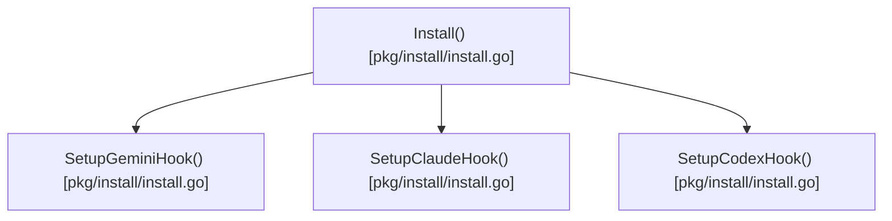

# install

This package handles the installation of Pith to the system PATH and the injection of hooks into AI agent CLI settings.

```mermaid
graph TD
    Install["Install() [pkg/install/install.go]"]
    Gemini["SetupGeminiHook() [pkg/install/install.go]"]
    Claude["SetupClaudeHook() [pkg/install/install.go]"]
    Codex["SetupCodexHook() [pkg/install/install.go]"]
    
    Install --> Gemini
    Install --> Claude
    Install --> Codex
```
