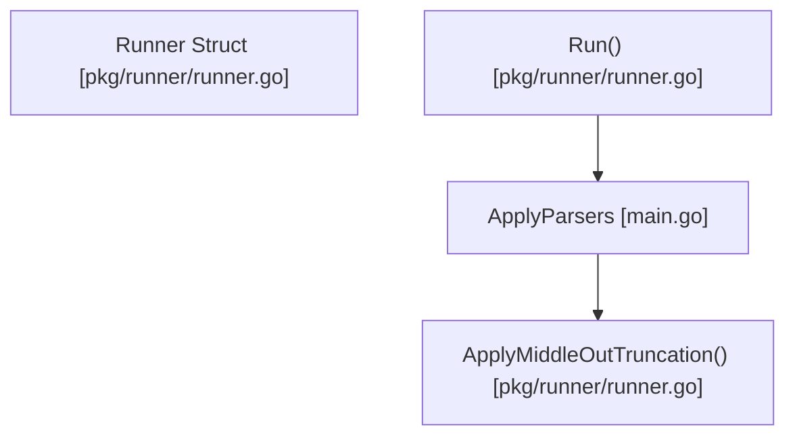

# runner

The runner package is responsible for executing proxied commands, applying parsers to the output, and handling systemic truncation.

```mermaid
graph TD
    Runner["Runner Struct [pkg/runner/runner.go]"]
    Run["Run() [pkg/runner/runner.go]"]
    ApplyParsers["ApplyParsers [main.go]"]
    ApplyTruncation["ApplyMiddleOutTruncation() [pkg/runner/runner.go]"]
    
    Run --> ApplyParsers
    ApplyParsers --> ApplyTruncation
```
