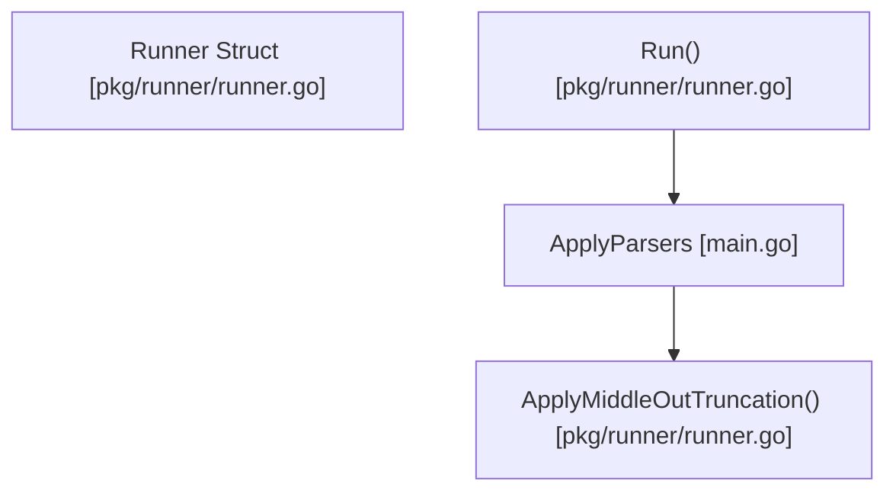

# runner

The runner package is responsible for executing proxied commands, applying parsers to the output, and handling systemic truncation.




## Architecture

<!-- mermaid-start -->
```mermaid
graph TD
    e__repos_pith_pkg_runner_readme_md["[MODULE] /repos/pith/pkg/runner/readme.md [readme.md]"]
    e__repos_pith_pkg_runner_runner_go["[MODULE] /repos/pith/pkg/runner/runner.go [runner.go]"]
    e__repos_pith_pkg_runner_runner_go_logforsnag["[FUNCTION] logforsnag [runner.go]"]
    e__repos_pith_pkg_runner_runner_go_runwithoptions["[FUNCTION] runwithoptions [runner.go]"]
    e__repos_pith_pkg_runner_runner_go_applymiddleouttruncation["[FUNCTION] applymiddleouttruncation [runner.go]"]
    e__repos_pith_pkg_runner_runner_go_estimatetokens["[FUNCTION] estimatetokens [runner.go]"]
    e__repos_pith_pkg_runner_runner_go_runner["[STRUCT] runner [runner.go]"]
    e__repos_pith_pkg_runner_runner_go_newrunner["[FUNCTION] newrunner [runner.go]"]
    e__repos_pith_pkg_runner_runner_go_detectsource["[FUNCTION] detectsource [runner.go]"]
    e__repos_pith_pkg_runner_runner_go_run["[FUNCTION] run [runner.go]"]
    e__repos_pith_pkg_runner_runner_test_go["[MODULE] /repos/pith/pkg/runner/runner_test.go [runner_test.go]"]
    e__repos_pith_pkg_runner_runner_test_go_testestimatetokens["[FUNCTION] testestimatetokens [runner_test.go]"]
    e__repos_pith_pkg_runner_runner_test_go_testrunner["[FUNCTION] testrunner [runner_test.go]"]
    e__repos_pith_pkg_runner_runner_test_go_testmiddleouttruncation["[FUNCTION] testmiddleouttruncation [runner_test.go]"]
    bytes[["[EXTERNAL] bytes"]]
    e__repos_pith_pkg_runner_runner_go -.->|imports|  bytes
    pith_pkg_config[["[EXTERNAL] config"]]
    e__repos_pith_pkg_runner_runner_go -.->|imports|  pith_pkg_config
    pith_pkg_parser[["[EXTERNAL] parser"]]
    e__repos_pith_pkg_runner_runner_go -.->|imports|  pith_pkg_parser
    pith_pkg_telemetry[["[EXTERNAL] telemetry"]]
    e__repos_pith_pkg_runner_runner_go -.->|imports|  pith_pkg_telemetry
    fmt[["[EXTERNAL] fmt"]]
    e__repos_pith_pkg_runner_runner_go -.->|imports|  fmt
    os[["[EXTERNAL] os"]]
    e__repos_pith_pkg_runner_runner_go -.->|imports|  os
    os_exec[["[EXTERNAL] exec"]]
    e__repos_pith_pkg_runner_runner_go -.->|imports|  os_exec
    path_filepath[["[EXTERNAL] filepath"]]
    e__repos_pith_pkg_runner_runner_go -.->|imports|  path_filepath
    strings[["[EXTERNAL] strings"]]
    e__repos_pith_pkg_runner_runner_go -.->|imports|  strings
    time[["[EXTERNAL] time"]]
    e__repos_pith_pkg_runner_runner_go -.->|imports|  time
    unicode_utf8[["[EXTERNAL] utf8"]]
    e__repos_pith_pkg_runner_runner_go -.->|imports|  unicode_utf8
    getallparsers[["[EXTERNAL] getallparsers"]]
    e__repos_pith_pkg_runner_runner_go_newrunner -->|calls| getallparsers
    parser_getallparsers[["[EXTERNAL] parser.getallparsers"]]
    e__repos_pith_pkg_runner_runner_go_newrunner -->|calls| parser_getallparsers
    detectsource[["[EXTERNAL] detectsource"]]
    e__repos_pith_pkg_runner_runner_go_newrunner -->|calls| detectsource
    getenv[["[EXTERNAL] getenv"]]
    e__repos_pith_pkg_runner_runner_go_detectsource -->|calls| getenv
    os_getenv[["[EXTERNAL] os.getenv"]]
    e__repos_pith_pkg_runner_runner_go_detectsource -->|calls| os_getenv
    runwithoptions[["[EXTERNAL] runwithoptions"]]
    e__repos_pith_pkg_runner_runner_go_run -->|calls| runwithoptions
    r_runwithoptions[["[EXTERNAL] r.runwithoptions"]]
    e__repos_pith_pkg_runner_runner_go_run -->|calls| r_runwithoptions
    userhomedir[["[EXTERNAL] userhomedir"]]
    e__repos_pith_pkg_runner_runner_go_logforsnag -->|calls| userhomedir
    os_userhomedir[["[EXTERNAL] os.userhomedir"]]
    e__repos_pith_pkg_runner_runner_go_logforsnag -->|calls| os_userhomedir
    join[["[EXTERNAL] join"]]
    e__repos_pith_pkg_runner_runner_go_logforsnag -->|calls| join
    filepath_join[["[EXTERNAL] filepath.join"]]
    e__repos_pith_pkg_runner_runner_go_logforsnag -->|calls| filepath_join
    mkdirall[["[EXTERNAL] mkdirall"]]
    e__repos_pith_pkg_runner_runner_go_logforsnag -->|calls| mkdirall
    os_mkdirall[["[EXTERNAL] os.mkdirall"]]
    e__repos_pith_pkg_runner_runner_go_logforsnag -->|calls| os_mkdirall
    openfile[["[EXTERNAL] openfile"]]
    e__repos_pith_pkg_runner_runner_go_logforsnag -->|calls| openfile
    os_openfile[["[EXTERNAL] os.openfile"]]
    e__repos_pith_pkg_runner_runner_go_logforsnag -->|calls| os_openfile
    close[["[EXTERNAL] close"]]
    e__repos_pith_pkg_runner_runner_go_logforsnag -->|calls| close
    f_close[["[EXTERNAL] f.close"]]
    e__repos_pith_pkg_runner_runner_go_logforsnag -->|calls| f_close
    split[["[EXTERNAL] split"]]
    e__repos_pith_pkg_runner_runner_go_logforsnag -->|calls| split
    strings_split[["[EXTERNAL] strings.split"]]
    e__repos_pith_pkg_runner_runner_go_logforsnag -->|calls| strings_split
    len[["[EXTERNAL] len"]]
    e__repos_pith_pkg_runner_runner_go_logforsnag -->|calls| len
    strings_join[["[EXTERNAL] strings.join"]]
    e__repos_pith_pkg_runner_runner_go_logforsnag -->|calls| strings_join
    sprintf[["[EXTERNAL] sprintf"]]
    e__repos_pith_pkg_runner_runner_go_logforsnag -->|calls| sprintf
    fmt_sprintf[["[EXTERNAL] fmt.sprintf"]]
    e__repos_pith_pkg_runner_runner_go_logforsnag -->|calls| fmt_sprintf
    hassuffix[["[EXTERNAL] hassuffix"]]
    e__repos_pith_pkg_runner_runner_go_logforsnag -->|calls| hassuffix
    strings_hassuffix[["[EXTERNAL] strings.hassuffix"]]
    e__repos_pith_pkg_runner_runner_go_logforsnag -->|calls| strings_hassuffix
    writestring[["[EXTERNAL] writestring"]]
    e__repos_pith_pkg_runner_runner_go_logforsnag -->|calls| writestring
    f_writestring[["[EXTERNAL] f.writestring"]]
    e__repos_pith_pkg_runner_runner_go_logforsnag -->|calls| f_writestring
    e__repos_pith_pkg_runner_runner_go_runwithoptions -->|calls| len
    errorf[["[EXTERNAL] errorf"]]
    e__repos_pith_pkg_runner_runner_go_runwithoptions -->|calls| errorf
    fmt_errorf[["[EXTERNAL] fmt.errorf"]]
    e__repos_pith_pkg_runner_runner_go_runwithoptions -->|calls| fmt_errorf
    e__repos_pith_pkg_runner_runner_go_runwithoptions -->|calls| join
    e__repos_pith_pkg_runner_runner_go_runwithoptions -->|calls| strings_join
    now[["[EXTERNAL] now"]]
    e__repos_pith_pkg_runner_runner_go_runwithoptions -->|calls| now
    time_now[["[EXTERNAL] time.now"]]
    e__repos_pith_pkg_runner_runner_go_runwithoptions -->|calls| time_now
    containsany[["[EXTERNAL] containsany"]]
    e__repos_pith_pkg_runner_runner_go_runwithoptions -->|calls| containsany
    strings_containsany[["[EXTERNAL] strings.containsany"]]
    e__repos_pith_pkg_runner_runner_go_runwithoptions -->|calls| strings_containsany
    command[["[EXTERNAL] command"]]
    e__repos_pith_pkg_runner_runner_go_runwithoptions -->|calls| command
    exec_command[["[EXTERNAL] exec.command"]]
    e__repos_pith_pkg_runner_runner_go_runwithoptions -->|calls| exec_command
    contains[["[EXTERNAL] contains"]]
    e__repos_pith_pkg_runner_runner_go_runwithoptions -->|calls| contains
    strings_contains[["[EXTERNAL] strings.contains"]]
    e__repos_pith_pkg_runner_runner_go_runwithoptions -->|calls| strings_contains
    fields[["[EXTERNAL] fields"]]
    e__repos_pith_pkg_runner_runner_go_runwithoptions -->|calls| fields
    strings_fields[["[EXTERNAL] strings.fields"]]
    e__repos_pith_pkg_runner_runner_go_runwithoptions -->|calls| strings_fields
    run[["[EXTERNAL] run"]]
    e__repos_pith_pkg_runner_runner_go_runwithoptions -->|calls| run
    cmd_run[["[EXTERNAL] cmd.run"]]
    e__repos_pith_pkg_runner_runner_go_runwithoptions -->|calls| cmd_run
    since[["[EXTERNAL] since"]]
    e__repos_pith_pkg_runner_runner_go_runwithoptions -->|calls| since
    time_since[["[EXTERNAL] time.since"]]
    e__repos_pith_pkg_runner_runner_go_runwithoptions -->|calls| time_since
    milliseconds[["[EXTERNAL] milliseconds"]]
    e__repos_pith_pkg_runner_runner_go_runwithoptions -->|calls| milliseconds
    exitcode[["[EXTERNAL] exitcode"]]
    e__repos_pith_pkg_runner_runner_go_runwithoptions -->|calls| exitcode
    exiterr_exitcode[["[EXTERNAL] exiterr.exitcode"]]
    e__repos_pith_pkg_runner_runner_go_runwithoptions -->|calls| exiterr_exitcode
    string[["[EXTERNAL] string"]]
    e__repos_pith_pkg_runner_runner_go_runwithoptions -->|calls| string
    out_string[["[EXTERNAL] out.string"]]
    e__repos_pith_pkg_runner_runner_go_runwithoptions -->|calls| out_string
    stderr_string[["[EXTERNAL] stderr.string"]]
    e__repos_pith_pkg_runner_runner_go_runwithoptions -->|calls| stderr_string
    logforsnag[["[EXTERNAL] logforsnag"]]
    e__repos_pith_pkg_runner_runner_go_runwithoptions -->|calls| logforsnag
    r_logforsnag[["[EXTERNAL] r.logforsnag"]]
    e__repos_pith_pkg_runner_runner_go_runwithoptions -->|calls| r_logforsnag
    estimatetokens[["[EXTERNAL] estimatetokens"]]
    e__repos_pith_pkg_runner_runner_go_runwithoptions -->|calls| estimatetokens
    splitsubcommands[["[EXTERNAL] splitsubcommands"]]
    e__repos_pith_pkg_runner_runner_go_runwithoptions -->|calls| splitsubcommands
    cp_splitsubcommands[["[EXTERNAL] cp.splitsubcommands"]]
    e__repos_pith_pkg_runner_runner_go_runwithoptions -->|calls| cp_splitsubcommands
    name[["[EXTERNAL] name"]]
    e__repos_pith_pkg_runner_runner_go_runwithoptions -->|calls| name
    pcandidate_name[["[EXTERNAL] pcandidate.name"]]
    e__repos_pith_pkg_runner_runner_go_runwithoptions -->|calls| pcandidate_name
    canparse[["[EXTERNAL] canparse"]]
    e__repos_pith_pkg_runner_runner_go_runwithoptions -->|calls| canparse
    pcandidate_canparse[["[EXTERNAL] pcandidate.canparse"]]
    e__repos_pith_pkg_runner_runner_go_runwithoptions -->|calls| pcandidate_canparse
    parser_name[["[EXTERNAL] parser.name"]]
    e__repos_pith_pkg_runner_runner_go_runwithoptions -->|calls| parser_name
    parser_canparse[["[EXTERNAL] parser.canparse"]]
    e__repos_pith_pkg_runner_runner_go_runwithoptions -->|calls| parser_canparse
    parse[["[EXTERNAL] parse"]]
    e__repos_pith_pkg_runner_runner_go_runwithoptions -->|calls| parse
    p_parse[["[EXTERNAL] p.parse"]]
    e__repos_pith_pkg_runner_runner_go_runwithoptions -->|calls| p_parse
    p_name[["[EXTERNAL] p.name"]]
    e__repos_pith_pkg_runner_runner_go_runwithoptions -->|calls| p_name
    applymiddleouttruncation[["[EXTERNAL] applymiddleouttruncation"]]
    e__repos_pith_pkg_runner_runner_go_runwithoptions -->|calls| applymiddleouttruncation
    r_applymiddleouttruncation[["[EXTERNAL] r.applymiddleouttruncation"]]
    e__repos_pith_pkg_runner_runner_go_runwithoptions -->|calls| r_applymiddleouttruncation
    print[["[EXTERNAL] print"]]
    e__repos_pith_pkg_runner_runner_go_runwithoptions -->|calls| print
    fmt_print[["[EXTERNAL] fmt.print"]]
    e__repos_pith_pkg_runner_runner_go_runwithoptions -->|calls| fmt_print
    record[["[EXTERNAL] record"]]
    e__repos_pith_pkg_runner_runner_go_runwithoptions -->|calls| record
    e__repos_pith_pkg_runner_runner_go_applymiddleouttruncation -->|calls| split
    e__repos_pith_pkg_runner_runner_go_applymiddleouttruncation -->|calls| strings_split
    e__repos_pith_pkg_runner_runner_go_applymiddleouttruncation -->|calls| len
    append[["[EXTERNAL] append"]]
    e__repos_pith_pkg_runner_runner_go_applymiddleouttruncation -->|calls| append
    e__repos_pith_pkg_runner_runner_go_applymiddleouttruncation -->|calls| sprintf
    e__repos_pith_pkg_runner_runner_go_applymiddleouttruncation -->|calls| fmt_sprintf
    e__repos_pith_pkg_runner_runner_go_applymiddleouttruncation -->|calls| join
    e__repos_pith_pkg_runner_runner_go_applymiddleouttruncation -->|calls| strings_join
    runecountinstring[["[EXTERNAL] runecountinstring"]]
    e__repos_pith_pkg_runner_runner_go_estimatetokens -->|calls| runecountinstring
    utf8_runecountinstring[["[EXTERNAL] utf8.runecountinstring"]]
    e__repos_pith_pkg_runner_runner_go_estimatetokens -->|calls| utf8_runecountinstring
    e__repos_pith_pkg_runner_runner_go ==>|contains| e__repos_pith_pkg_runner_runner_go_logforsnag
    e__repos_pith_pkg_runner_runner_go ==>|contains| e__repos_pith_pkg_runner_runner_go_runwithoptions
    e__repos_pith_pkg_runner_runner_go ==>|contains| e__repos_pith_pkg_runner_runner_go_applymiddleouttruncation
    e__repos_pith_pkg_runner_runner_go ==>|contains| e__repos_pith_pkg_runner_runner_go_estimatetokens
    e__repos_pith_pkg_runner_runner_go ==>|contains| e__repos_pith_pkg_runner_runner_go_runner
    e__repos_pith_pkg_runner_runner_go ==>|contains| e__repos_pith_pkg_runner_runner_go_newrunner
    e__repos_pith_pkg_runner_runner_go ==>|contains| e__repos_pith_pkg_runner_runner_go_detectsource
    e__repos_pith_pkg_runner_runner_go ==>|contains| e__repos_pith_pkg_runner_runner_go_run
    e__repos_pith_pkg_runner_runner_test_go -.->|imports|  pith_pkg_config
    e__repos_pith_pkg_runner_runner_test_go -.->|imports|  pith_pkg_telemetry
    e__repos_pith_pkg_runner_runner_test_go -.->|imports|  os
    e__repos_pith_pkg_runner_runner_test_go -.->|imports|  path_filepath
    e__repos_pith_pkg_runner_runner_test_go -.->|imports|  strings
    testing[["[EXTERNAL] testing"]]
    e__repos_pith_pkg_runner_runner_test_go -.->|imports|  testing
    e__repos_pith_pkg_runner_runner_test_go_testestimatetokens -->|calls| estimatetokens
    e__repos_pith_pkg_runner_runner_test_go_testestimatetokens -->|calls| errorf
    t_errorf[["[EXTERNAL] t.errorf"]]
    e__repos_pith_pkg_runner_runner_test_go_testestimatetokens -->|calls| t_errorf
    mkdirtemp[["[EXTERNAL] mkdirtemp"]]
    e__repos_pith_pkg_runner_runner_test_go_testrunner -->|calls| mkdirtemp
    os_mkdirtemp[["[EXTERNAL] os.mkdirtemp"]]
    e__repos_pith_pkg_runner_runner_test_go_testrunner -->|calls| os_mkdirtemp
    removeall[["[EXTERNAL] removeall"]]
    e__repos_pith_pkg_runner_runner_test_go_testrunner -->|calls| removeall
    os_removeall[["[EXTERNAL] os.removeall"]]
    e__repos_pith_pkg_runner_runner_test_go_testrunner -->|calls| os_removeall
    e__repos_pith_pkg_runner_runner_test_go_testrunner -->|calls| join
    e__repos_pith_pkg_runner_runner_test_go_testrunner -->|calls| filepath_join
    newtelemetrywithpath[["[EXTERNAL] newtelemetrywithpath"]]
    e__repos_pith_pkg_runner_runner_test_go_testrunner -->|calls| newtelemetrywithpath
    telemetry_newtelemetrywithpath[["[EXTERNAL] telemetry.newtelemetrywithpath"]]
    e__repos_pith_pkg_runner_runner_test_go_testrunner -->|calls| telemetry_newtelemetrywithpath
    e__repos_pith_pkg_runner_runner_test_go_testrunner -->|calls| close
    tel_close[["[EXTERNAL] tel.close"]]
    e__repos_pith_pkg_runner_runner_test_go_testrunner -->|calls| tel_close
    newrunner[["[EXTERNAL] newrunner"]]
    e__repos_pith_pkg_runner_runner_test_go_testrunner -->|calls| newrunner
    e__repos_pith_pkg_runner_runner_test_go_testrunner -->|calls| len
    error[["[EXTERNAL] error"]]
    e__repos_pith_pkg_runner_runner_test_go_testrunner -->|calls| error
    t_error[["[EXTERNAL] t.error"]]
    e__repos_pith_pkg_runner_runner_test_go_testrunner -->|calls| t_error
    e__repos_pith_pkg_runner_runner_test_go_testmiddleouttruncation -->|calls| newrunner
    e__repos_pith_pkg_runner_runner_test_go_testmiddleouttruncation -->|calls| applymiddleouttruncation
    run_applymiddleouttruncation[["[EXTERNAL] run.applymiddleouttruncation"]]
    e__repos_pith_pkg_runner_runner_test_go_testmiddleouttruncation -->|calls| run_applymiddleouttruncation
    e__repos_pith_pkg_runner_runner_test_go_testmiddleouttruncation -->|calls| contains
    e__repos_pith_pkg_runner_runner_test_go_testmiddleouttruncation -->|calls| strings_contains
    e__repos_pith_pkg_runner_runner_test_go_testmiddleouttruncation -->|calls| error
    e__repos_pith_pkg_runner_runner_test_go_testmiddleouttruncation -->|calls| t_error
    hasprefix[["[EXTERNAL] hasprefix"]]
    e__repos_pith_pkg_runner_runner_test_go_testmiddleouttruncation -->|calls| hasprefix
    strings_hasprefix[["[EXTERNAL] strings.hasprefix"]]
    e__repos_pith_pkg_runner_runner_test_go_testmiddleouttruncation -->|calls| strings_hasprefix
    e__repos_pith_pkg_runner_runner_test_go_testmiddleouttruncation -->|calls| hassuffix
    e__repos_pith_pkg_runner_runner_test_go_testmiddleouttruncation -->|calls| strings_hassuffix
    e__repos_pith_pkg_runner_runner_test_go ==>|contains| e__repos_pith_pkg_runner_runner_test_go_testestimatetokens
    e__repos_pith_pkg_runner_runner_test_go ==>|contains| e__repos_pith_pkg_runner_runner_test_go_testrunner
    e__repos_pith_pkg_runner_runner_test_go ==>|contains| e__repos_pith_pkg_runner_runner_test_go_testmiddleouttruncation
```
<!-- mermaid-end -->
