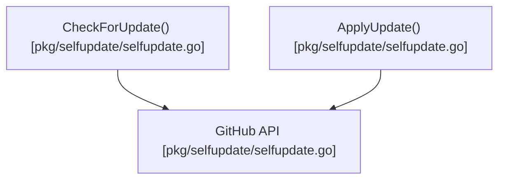

# selfupdate

This package manages Pith's self-update mechanism, checking for new versions and applying binary updates from GitHub.




## Architecture

<!-- mermaid-start -->
```mermaid
graph TD
    e__repos_pith_pkg_selfupdate_readme_md["[MODULE] /repos/pith/pkg/selfupdate/readme.md [readme.md]"]
    e__repos_pith_pkg_selfupdate_selfupdate_go["[MODULE] /repos/pith/pkg/selfupdate/selfupdate.go [selfupdate.go]"]
    e__repos_pith_pkg_selfupdate_selfupdate_go_getauthtoken["[FUNCTION] getauthtoken [selfupdate.go]"]
    e__repos_pith_pkg_selfupdate_selfupdate_go_checkandapplyupdate["[FUNCTION] checkandapplyupdate [selfupdate.go]"]
    e__repos_pith_pkg_selfupdate_selfupdate_go_checkforupdatesilent["[FUNCTION] checkforupdatesilent [selfupdate.go]"]
    e__repos_pith_pkg_selfupdate_selfupdate_go_downloadandreplace["[FUNCTION] downloadandreplace [selfupdate.go]"]
    e__repos_pith_pkg_selfupdate_selfupdate_go_release["[STRUCT] release [selfupdate.go]"]
    bytes[["[EXTERNAL] bytes"]]
    e__repos_pith_pkg_selfupdate_selfupdate_go -.->|imports|  bytes
    encoding_json[["[EXTERNAL] json"]]
    e__repos_pith_pkg_selfupdate_selfupdate_go -.->|imports|  encoding_json
    fmt[["[EXTERNAL] fmt"]]
    e__repos_pith_pkg_selfupdate_selfupdate_go -.->|imports|  fmt
    io[["[EXTERNAL] io"]]
    e__repos_pith_pkg_selfupdate_selfupdate_go -.->|imports|  io
    net_http[["[EXTERNAL] http"]]
    e__repos_pith_pkg_selfupdate_selfupdate_go -.->|imports|  net_http
    os[["[EXTERNAL] os"]]
    e__repos_pith_pkg_selfupdate_selfupdate_go -.->|imports|  os
    os_exec[["[EXTERNAL] exec"]]
    e__repos_pith_pkg_selfupdate_selfupdate_go -.->|imports|  os_exec
    runtime[["[EXTERNAL] runtime"]]
    e__repos_pith_pkg_selfupdate_selfupdate_go -.->|imports|  runtime
    strings[["[EXTERNAL] strings"]]
    e__repos_pith_pkg_selfupdate_selfupdate_go -.->|imports|  strings
    getenv[["[EXTERNAL] getenv"]]
    e__repos_pith_pkg_selfupdate_selfupdate_go_getauthtoken -->|calls| getenv
    os_getenv[["[EXTERNAL] os.getenv"]]
    e__repos_pith_pkg_selfupdate_selfupdate_go_getauthtoken -->|calls| os_getenv
    command[["[EXTERNAL] command"]]
    e__repos_pith_pkg_selfupdate_selfupdate_go_getauthtoken -->|calls| command
    exec_command[["[EXTERNAL] exec.command"]]
    e__repos_pith_pkg_selfupdate_selfupdate_go_getauthtoken -->|calls| exec_command
    run[["[EXTERNAL] run"]]
    e__repos_pith_pkg_selfupdate_selfupdate_go_getauthtoken -->|calls| run
    cmd_run[["[EXTERNAL] cmd.run"]]
    e__repos_pith_pkg_selfupdate_selfupdate_go_getauthtoken -->|calls| cmd_run
    trimspace[["[EXTERNAL] trimspace"]]
    e__repos_pith_pkg_selfupdate_selfupdate_go_getauthtoken -->|calls| trimspace
    strings_trimspace[["[EXTERNAL] strings.trimspace"]]
    e__repos_pith_pkg_selfupdate_selfupdate_go_getauthtoken -->|calls| strings_trimspace
    string[["[EXTERNAL] string"]]
    e__repos_pith_pkg_selfupdate_selfupdate_go_getauthtoken -->|calls| string
    out_string[["[EXTERNAL] out.string"]]
    e__repos_pith_pkg_selfupdate_selfupdate_go_getauthtoken -->|calls| out_string
    newrequest[["[EXTERNAL] newrequest"]]
    e__repos_pith_pkg_selfupdate_selfupdate_go_checkandapplyupdate -->|calls| newrequest
    http_newrequest[["[EXTERNAL] http.newrequest"]]
    e__repos_pith_pkg_selfupdate_selfupdate_go_checkandapplyupdate -->|calls| http_newrequest
    sprintf[["[EXTERNAL] sprintf"]]
    e__repos_pith_pkg_selfupdate_selfupdate_go_checkandapplyupdate -->|calls| sprintf
    fmt_sprintf[["[EXTERNAL] fmt.sprintf"]]
    e__repos_pith_pkg_selfupdate_selfupdate_go_checkandapplyupdate -->|calls| fmt_sprintf
    set[["[EXTERNAL] set"]]
    e__repos_pith_pkg_selfupdate_selfupdate_go_checkandapplyupdate -->|calls| set
    getauthtoken[["[EXTERNAL] getauthtoken"]]
    e__repos_pith_pkg_selfupdate_selfupdate_go_checkandapplyupdate -->|calls| getauthtoken
    do[["[EXTERNAL] do"]]
    e__repos_pith_pkg_selfupdate_selfupdate_go_checkandapplyupdate -->|calls| do
    client_do[["[EXTERNAL] client.do"]]
    e__repos_pith_pkg_selfupdate_selfupdate_go_checkandapplyupdate -->|calls| client_do
    close[["[EXTERNAL] close"]]
    e__repos_pith_pkg_selfupdate_selfupdate_go_checkandapplyupdate -->|calls| close
    errorf[["[EXTERNAL] errorf"]]
    e__repos_pith_pkg_selfupdate_selfupdate_go_checkandapplyupdate -->|calls| errorf
    fmt_errorf[["[EXTERNAL] fmt.errorf"]]
    e__repos_pith_pkg_selfupdate_selfupdate_go_checkandapplyupdate -->|calls| fmt_errorf
    newdecoder[["[EXTERNAL] newdecoder"]]
    e__repos_pith_pkg_selfupdate_selfupdate_go_checkandapplyupdate -->|calls| newdecoder
    json_newdecoder[["[EXTERNAL] json.newdecoder"]]
    e__repos_pith_pkg_selfupdate_selfupdate_go_checkandapplyupdate -->|calls| json_newdecoder
    decode[["[EXTERNAL] decode"]]
    e__repos_pith_pkg_selfupdate_selfupdate_go_checkandapplyupdate -->|calls| decode
    len[["[EXTERNAL] len"]]
    e__repos_pith_pkg_selfupdate_selfupdate_go_checkandapplyupdate -->|calls| len
    printf[["[EXTERNAL] printf"]]
    e__repos_pith_pkg_selfupdate_selfupdate_go_checkandapplyupdate -->|calls| printf
    fmt_printf[["[EXTERNAL] fmt.printf"]]
    e__repos_pith_pkg_selfupdate_selfupdate_go_checkandapplyupdate -->|calls| fmt_printf
    hassuffix[["[EXTERNAL] hassuffix"]]
    e__repos_pith_pkg_selfupdate_selfupdate_go_checkandapplyupdate -->|calls| hassuffix
    strings_hassuffix[["[EXTERNAL] strings.hassuffix"]]
    e__repos_pith_pkg_selfupdate_selfupdate_go_checkandapplyupdate -->|calls| strings_hassuffix
    println[["[EXTERNAL] println"]]
    e__repos_pith_pkg_selfupdate_selfupdate_go_checkandapplyupdate -->|calls| println
    fmt_println[["[EXTERNAL] fmt.println"]]
    e__repos_pith_pkg_selfupdate_selfupdate_go_checkandapplyupdate -->|calls| fmt_println
    downloadandreplace[["[EXTERNAL] downloadandreplace"]]
    e__repos_pith_pkg_selfupdate_selfupdate_go_checkandapplyupdate -->|calls| downloadandreplace
    e__repos_pith_pkg_selfupdate_selfupdate_go_checkforupdatesilent -->|calls| newrequest
    e__repos_pith_pkg_selfupdate_selfupdate_go_checkforupdatesilent -->|calls| http_newrequest
    e__repos_pith_pkg_selfupdate_selfupdate_go_checkforupdatesilent -->|calls| sprintf
    e__repos_pith_pkg_selfupdate_selfupdate_go_checkforupdatesilent -->|calls| fmt_sprintf
    e__repos_pith_pkg_selfupdate_selfupdate_go_checkforupdatesilent -->|calls| set
    e__repos_pith_pkg_selfupdate_selfupdate_go_checkforupdatesilent -->|calls| getauthtoken
    e__repos_pith_pkg_selfupdate_selfupdate_go_checkforupdatesilent -->|calls| do
    e__repos_pith_pkg_selfupdate_selfupdate_go_checkforupdatesilent -->|calls| client_do
    e__repos_pith_pkg_selfupdate_selfupdate_go_checkforupdatesilent -->|calls| close
    e__repos_pith_pkg_selfupdate_selfupdate_go_checkforupdatesilent -->|calls| errorf
    e__repos_pith_pkg_selfupdate_selfupdate_go_checkforupdatesilent -->|calls| fmt_errorf
    e__repos_pith_pkg_selfupdate_selfupdate_go_checkforupdatesilent -->|calls| newdecoder
    e__repos_pith_pkg_selfupdate_selfupdate_go_checkforupdatesilent -->|calls| json_newdecoder
    e__repos_pith_pkg_selfupdate_selfupdate_go_checkforupdatesilent -->|calls| decode
    e__repos_pith_pkg_selfupdate_selfupdate_go_checkforupdatesilent -->|calls| len
    executable[["[EXTERNAL] executable"]]
    e__repos_pith_pkg_selfupdate_selfupdate_go_downloadandreplace -->|calls| executable
    os_executable[["[EXTERNAL] os.executable"]]
    e__repos_pith_pkg_selfupdate_selfupdate_go_downloadandreplace -->|calls| os_executable
    e__repos_pith_pkg_selfupdate_selfupdate_go_downloadandreplace -->|calls| newrequest
    e__repos_pith_pkg_selfupdate_selfupdate_go_downloadandreplace -->|calls| http_newrequest
    e__repos_pith_pkg_selfupdate_selfupdate_go_downloadandreplace -->|calls| set
    e__repos_pith_pkg_selfupdate_selfupdate_go_downloadandreplace -->|calls| do
    e__repos_pith_pkg_selfupdate_selfupdate_go_downloadandreplace -->|calls| client_do
    e__repos_pith_pkg_selfupdate_selfupdate_go_downloadandreplace -->|calls| close
    e__repos_pith_pkg_selfupdate_selfupdate_go_downloadandreplace -->|calls| errorf
    e__repos_pith_pkg_selfupdate_selfupdate_go_downloadandreplace -->|calls| fmt_errorf
    openfile[["[EXTERNAL] openfile"]]
    e__repos_pith_pkg_selfupdate_selfupdate_go_downloadandreplace -->|calls| openfile
    os_openfile[["[EXTERNAL] os.openfile"]]
    e__repos_pith_pkg_selfupdate_selfupdate_go_downloadandreplace -->|calls| os_openfile
    copy[["[EXTERNAL] copy"]]
    e__repos_pith_pkg_selfupdate_selfupdate_go_downloadandreplace -->|calls| copy
    io_copy[["[EXTERNAL] io.copy"]]
    e__repos_pith_pkg_selfupdate_selfupdate_go_downloadandreplace -->|calls| io_copy
    tmpfile_close[["[EXTERNAL] tmpfile.close"]]
    e__repos_pith_pkg_selfupdate_selfupdate_go_downloadandreplace -->|calls| tmpfile_close
    remove[["[EXTERNAL] remove"]]
    e__repos_pith_pkg_selfupdate_selfupdate_go_downloadandreplace -->|calls| remove
    os_remove[["[EXTERNAL] os.remove"]]
    e__repos_pith_pkg_selfupdate_selfupdate_go_downloadandreplace -->|calls| os_remove
    rename[["[EXTERNAL] rename"]]
    e__repos_pith_pkg_selfupdate_selfupdate_go_downloadandreplace -->|calls| rename
    os_rename[["[EXTERNAL] os.rename"]]
    e__repos_pith_pkg_selfupdate_selfupdate_go_downloadandreplace -->|calls| os_rename
    e__repos_pith_pkg_selfupdate_selfupdate_go_downloadandreplace -->|calls| println
    e__repos_pith_pkg_selfupdate_selfupdate_go_downloadandreplace -->|calls| fmt_println
    e__repos_pith_pkg_selfupdate_selfupdate_go ==>|contains| e__repos_pith_pkg_selfupdate_selfupdate_go_getauthtoken
    e__repos_pith_pkg_selfupdate_selfupdate_go ==>|contains| e__repos_pith_pkg_selfupdate_selfupdate_go_checkandapplyupdate
    e__repos_pith_pkg_selfupdate_selfupdate_go ==>|contains| e__repos_pith_pkg_selfupdate_selfupdate_go_checkforupdatesilent
    e__repos_pith_pkg_selfupdate_selfupdate_go ==>|contains| e__repos_pith_pkg_selfupdate_selfupdate_go_downloadandreplace
    e__repos_pith_pkg_selfupdate_selfupdate_go ==>|contains| e__repos_pith_pkg_selfupdate_selfupdate_go_release
```
<!-- mermaid-end -->
