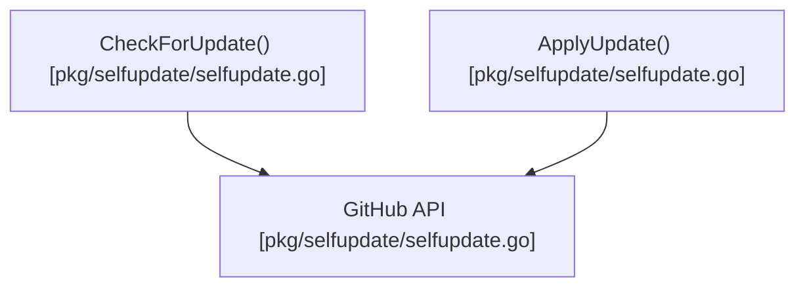

# selfupdate

This package manages Pith's self-update mechanism, checking for new versions and applying binary updates from GitHub.

```mermaid
graph TD
    Check["CheckForUpdate() [pkg/selfupdate/selfupdate.go]"]
    Apply["ApplyUpdate() [pkg/selfupdate/selfupdate.go]"]
    GitHub["GitHub API [pkg/selfupdate/selfupdate.go]"]
    
    Check --> GitHub
    Apply --> GitHub
```
