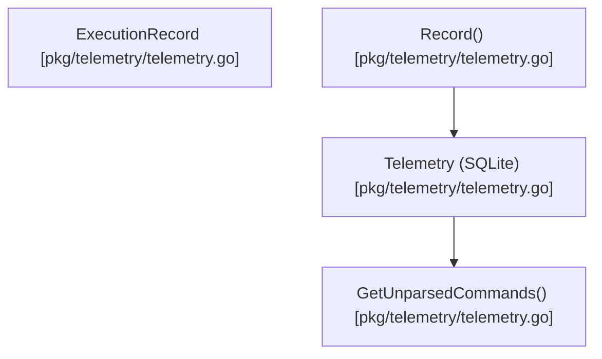

# telemetry

This package manages the recording and retrieval of command execution statistics and unparsed command discovery.




## Architecture

<!-- mermaid-start -->
```mermaid
graph TD
    e__repos_pith_pkg_telemetry_readme_md["[MODULE] /repos/pith/pkg/telemetry/readme.md [readme.md]"]
    e__repos_pith_pkg_telemetry_telemetry_go["[MODULE] /repos/pith/pkg/telemetry/telemetry.go [telemetry.go]"]
    e__repos_pith_pkg_telemetry_telemetry_go_newtelemetry["[FUNCTION] newtelemetry [telemetry.go]"]
    e__repos_pith_pkg_telemetry_telemetry_go_record["[FUNCTION] record [telemetry.go]"]
    e__repos_pith_pkg_telemetry_telemetry_go_getrecentexecutions["[FUNCTION] getrecentexecutions [telemetry.go]"]
    e__repos_pith_pkg_telemetry_telemetry_go_getsources["[FUNCTION] getsources [telemetry.go]"]
    e__repos_pith_pkg_telemetry_telemetry_go_newtelemetrywithpath["[FUNCTION] newtelemetrywithpath [telemetry.go]"]
    e__repos_pith_pkg_telemetry_telemetry_go_init["[FUNCTION] init [telemetry.go]"]
    e__repos_pith_pkg_telemetry_telemetry_go_getstats["[FUNCTION] getstats [telemetry.go]"]
    e__repos_pith_pkg_telemetry_telemetry_go_getstatsbycommand["[FUNCTION] getstatsbycommand [telemetry.go]"]
    e__repos_pith_pkg_telemetry_telemetry_go_resetpassthrough["[FUNCTION] resetpassthrough [telemetry.go]"]
    e__repos_pith_pkg_telemetry_telemetry_go_telemetry["[STRUCT] telemetry [telemetry.go]"]
    e__repos_pith_pkg_telemetry_telemetry_go_close["[FUNCTION] close [telemetry.go]"]
    e__repos_pith_pkg_telemetry_telemetry_go_executionrecord["[STRUCT] executionrecord [telemetry.go]"]
    e__repos_pith_pkg_telemetry_telemetry_go_getstatsbyday["[FUNCTION] getstatsbyday [telemetry.go]"]
    e__repos_pith_pkg_telemetry_telemetry_go_getunparsedcommands["[FUNCTION] getunparsedcommands [telemetry.go]"]
    e__repos_pith_pkg_telemetry_telemetry_go_resetall["[FUNCTION] resetall [telemetry.go]"]
    e__repos_pith_pkg_telemetry_telemetry_go_getexecutiondetails["[FUNCTION] getexecutiondetails [telemetry.go]"]
    e__repos_pith_pkg_telemetry_telemetry_test_go["[MODULE] /repos/pith/pkg/telemetry/telemetry_test.go [telemetry_test.go]"]
    e__repos_pith_pkg_telemetry_telemetry_test_go_testtelemetry["[FUNCTION] testtelemetry [telemetry_test.go]"]
    database_sql[["[EXTERNAL] sql"]]
    e__repos_pith_pkg_telemetry_telemetry_go -.->|imports|  database_sql
    fmt[["[EXTERNAL] fmt"]]
    e__repos_pith_pkg_telemetry_telemetry_go -.->|imports|  fmt
    os[["[EXTERNAL] os"]]
    e__repos_pith_pkg_telemetry_telemetry_go -.->|imports|  os
    path_filepath[["[EXTERNAL] filepath"]]
    e__repos_pith_pkg_telemetry_telemetry_go -.->|imports|  path_filepath
    time[["[EXTERNAL] time"]]
    e__repos_pith_pkg_telemetry_telemetry_go -.->|imports|  time
    modernc_org_sqlite[["[EXTERNAL] sqlite"]]
    e__repos_pith_pkg_telemetry_telemetry_go -.->|imports|  modernc_org_sqlite
    userhomedir[["[EXTERNAL] userhomedir"]]
    e__repos_pith_pkg_telemetry_telemetry_go_newtelemetry -->|calls| userhomedir
    os_userhomedir[["[EXTERNAL] os.userhomedir"]]
    e__repos_pith_pkg_telemetry_telemetry_go_newtelemetry -->|calls| os_userhomedir
    join[["[EXTERNAL] join"]]
    e__repos_pith_pkg_telemetry_telemetry_go_newtelemetry -->|calls| join
    filepath_join[["[EXTERNAL] filepath.join"]]
    e__repos_pith_pkg_telemetry_telemetry_go_newtelemetry -->|calls| filepath_join
    mkdirall[["[EXTERNAL] mkdirall"]]
    e__repos_pith_pkg_telemetry_telemetry_go_newtelemetry -->|calls| mkdirall
    os_mkdirall[["[EXTERNAL] os.mkdirall"]]
    e__repos_pith_pkg_telemetry_telemetry_go_newtelemetry -->|calls| os_mkdirall
    newtelemetrywithpath[["[EXTERNAL] newtelemetrywithpath"]]
    e__repos_pith_pkg_telemetry_telemetry_go_newtelemetry -->|calls| newtelemetrywithpath
    open[["[EXTERNAL] open"]]
    e__repos_pith_pkg_telemetry_telemetry_go_newtelemetrywithpath -->|calls| open
    sql_open[["[EXTERNAL] sql.open"]]
    e__repos_pith_pkg_telemetry_telemetry_go_newtelemetrywithpath -->|calls| sql_open
    init[["[EXTERNAL] init"]]
    e__repos_pith_pkg_telemetry_telemetry_go_newtelemetrywithpath -->|calls| init
    t_init[["[EXTERNAL] t.init"]]
    e__repos_pith_pkg_telemetry_telemetry_go_newtelemetrywithpath -->|calls| t_init
    exec[["[EXTERNAL] exec"]]
    e__repos_pith_pkg_telemetry_telemetry_go_init -->|calls| exec
    e__repos_pith_pkg_telemetry_telemetry_go_record -->|calls| exec
    append[["[EXTERNAL] append"]]
    e__repos_pith_pkg_telemetry_telemetry_go_getstatsbyday -->|calls| append
    sprintf[["[EXTERNAL] sprintf"]]
    e__repos_pith_pkg_telemetry_telemetry_go_getstatsbyday -->|calls| sprintf
    fmt_sprintf[["[EXTERNAL] fmt.sprintf"]]
    e__repos_pith_pkg_telemetry_telemetry_go_getstatsbyday -->|calls| fmt_sprintf
    query[["[EXTERNAL] query"]]
    e__repos_pith_pkg_telemetry_telemetry_go_getstatsbyday -->|calls| query
    close[["[EXTERNAL] close"]]
    e__repos_pith_pkg_telemetry_telemetry_go_getstatsbyday -->|calls| close
    rows_close[["[EXTERNAL] rows.close"]]
    e__repos_pith_pkg_telemetry_telemetry_go_getstatsbyday -->|calls| rows_close
    next[["[EXTERNAL] next"]]
    e__repos_pith_pkg_telemetry_telemetry_go_getstatsbyday -->|calls| next
    rows_next[["[EXTERNAL] rows.next"]]
    e__repos_pith_pkg_telemetry_telemetry_go_getstatsbyday -->|calls| rows_next
    scan[["[EXTERNAL] scan"]]
    e__repos_pith_pkg_telemetry_telemetry_go_getstatsbyday -->|calls| scan
    rows_scan[["[EXTERNAL] rows.scan"]]
    e__repos_pith_pkg_telemetry_telemetry_go_getstatsbyday -->|calls| rows_scan
    e__repos_pith_pkg_telemetry_telemetry_go_close -->|calls| close
    e__repos_pith_pkg_telemetry_telemetry_go_getunparsedcommands -->|calls| append
    e__repos_pith_pkg_telemetry_telemetry_go_getunparsedcommands -->|calls| sprintf
    e__repos_pith_pkg_telemetry_telemetry_go_getunparsedcommands -->|calls| fmt_sprintf
    e__repos_pith_pkg_telemetry_telemetry_go_getunparsedcommands -->|calls| query
    e__repos_pith_pkg_telemetry_telemetry_go_getunparsedcommands -->|calls| close
    e__repos_pith_pkg_telemetry_telemetry_go_getunparsedcommands -->|calls| rows_close
    e__repos_pith_pkg_telemetry_telemetry_go_getunparsedcommands -->|calls| next
    e__repos_pith_pkg_telemetry_telemetry_go_getunparsedcommands -->|calls| rows_next
    e__repos_pith_pkg_telemetry_telemetry_go_getunparsedcommands -->|calls| scan
    e__repos_pith_pkg_telemetry_telemetry_go_getunparsedcommands -->|calls| rows_scan
    e__repos_pith_pkg_telemetry_telemetry_go_getstats -->|calls| append
    e__repos_pith_pkg_telemetry_telemetry_go_getstats -->|calls| sprintf
    e__repos_pith_pkg_telemetry_telemetry_go_getstats -->|calls| fmt_sprintf
    queryrow[["[EXTERNAL] queryrow"]]
    e__repos_pith_pkg_telemetry_telemetry_go_getstats -->|calls| queryrow
    e__repos_pith_pkg_telemetry_telemetry_go_getstats -->|calls| scan
    e__repos_pith_pkg_telemetry_telemetry_go_getstatsbycommand -->|calls| append
    e__repos_pith_pkg_telemetry_telemetry_go_getstatsbycommand -->|calls| sprintf
    e__repos_pith_pkg_telemetry_telemetry_go_getstatsbycommand -->|calls| fmt_sprintf
    e__repos_pith_pkg_telemetry_telemetry_go_getstatsbycommand -->|calls| query
    e__repos_pith_pkg_telemetry_telemetry_go_getstatsbycommand -->|calls| close
    e__repos_pith_pkg_telemetry_telemetry_go_getstatsbycommand -->|calls| rows_close
    e__repos_pith_pkg_telemetry_telemetry_go_getstatsbycommand -->|calls| next
    e__repos_pith_pkg_telemetry_telemetry_go_getstatsbycommand -->|calls| rows_next
    e__repos_pith_pkg_telemetry_telemetry_go_getstatsbycommand -->|calls| scan
    e__repos_pith_pkg_telemetry_telemetry_go_getstatsbycommand -->|calls| rows_scan
    e__repos_pith_pkg_telemetry_telemetry_go_resetall -->|calls| exec
    e__repos_pith_pkg_telemetry_telemetry_go_resetpassthrough -->|calls| exec
    e__repos_pith_pkg_telemetry_telemetry_go_getrecentexecutions -->|calls| append
    e__repos_pith_pkg_telemetry_telemetry_go_getrecentexecutions -->|calls| sprintf
    e__repos_pith_pkg_telemetry_telemetry_go_getrecentexecutions -->|calls| fmt_sprintf
    e__repos_pith_pkg_telemetry_telemetry_go_getrecentexecutions -->|calls| query
    e__repos_pith_pkg_telemetry_telemetry_go_getrecentexecutions -->|calls| close
    e__repos_pith_pkg_telemetry_telemetry_go_getrecentexecutions -->|calls| rows_close
    e__repos_pith_pkg_telemetry_telemetry_go_getrecentexecutions -->|calls| next
    e__repos_pith_pkg_telemetry_telemetry_go_getrecentexecutions -->|calls| rows_next
    e__repos_pith_pkg_telemetry_telemetry_go_getrecentexecutions -->|calls| scan
    e__repos_pith_pkg_telemetry_telemetry_go_getrecentexecutions -->|calls| rows_scan
    e__repos_pith_pkg_telemetry_telemetry_go_getsources -->|calls| query
    e__repos_pith_pkg_telemetry_telemetry_go_getsources -->|calls| close
    e__repos_pith_pkg_telemetry_telemetry_go_getsources -->|calls| rows_close
    e__repos_pith_pkg_telemetry_telemetry_go_getsources -->|calls| next
    e__repos_pith_pkg_telemetry_telemetry_go_getsources -->|calls| rows_next
    e__repos_pith_pkg_telemetry_telemetry_go_getsources -->|calls| scan
    e__repos_pith_pkg_telemetry_telemetry_go_getsources -->|calls| rows_scan
    e__repos_pith_pkg_telemetry_telemetry_go_getsources -->|calls| append
    e__repos_pith_pkg_telemetry_telemetry_go_getexecutiondetails -->|calls| queryrow
    e__repos_pith_pkg_telemetry_telemetry_go_getexecutiondetails -->|calls| scan
    e__repos_pith_pkg_telemetry_telemetry_go ==>|contains| e__repos_pith_pkg_telemetry_telemetry_go_newtelemetry
    e__repos_pith_pkg_telemetry_telemetry_go ==>|contains| e__repos_pith_pkg_telemetry_telemetry_go_record
    e__repos_pith_pkg_telemetry_telemetry_go ==>|contains| e__repos_pith_pkg_telemetry_telemetry_go_getrecentexecutions
    e__repos_pith_pkg_telemetry_telemetry_go ==>|contains| e__repos_pith_pkg_telemetry_telemetry_go_getsources
    e__repos_pith_pkg_telemetry_telemetry_go ==>|contains| e__repos_pith_pkg_telemetry_telemetry_go_newtelemetrywithpath
    e__repos_pith_pkg_telemetry_telemetry_go ==>|contains| e__repos_pith_pkg_telemetry_telemetry_go_init
    e__repos_pith_pkg_telemetry_telemetry_go ==>|contains| e__repos_pith_pkg_telemetry_telemetry_go_getstats
    e__repos_pith_pkg_telemetry_telemetry_go ==>|contains| e__repos_pith_pkg_telemetry_telemetry_go_getstatsbycommand
    e__repos_pith_pkg_telemetry_telemetry_go ==>|contains| e__repos_pith_pkg_telemetry_telemetry_go_resetpassthrough
    e__repos_pith_pkg_telemetry_telemetry_go ==>|contains| e__repos_pith_pkg_telemetry_telemetry_go_telemetry
    e__repos_pith_pkg_telemetry_telemetry_go ==>|contains| e__repos_pith_pkg_telemetry_telemetry_go_close
    e__repos_pith_pkg_telemetry_telemetry_go ==>|contains| e__repos_pith_pkg_telemetry_telemetry_go_executionrecord
    e__repos_pith_pkg_telemetry_telemetry_go ==>|contains| e__repos_pith_pkg_telemetry_telemetry_go_getstatsbyday
    e__repos_pith_pkg_telemetry_telemetry_go ==>|contains| e__repos_pith_pkg_telemetry_telemetry_go_getunparsedcommands
    e__repos_pith_pkg_telemetry_telemetry_go ==>|contains| e__repos_pith_pkg_telemetry_telemetry_go_resetall
    e__repos_pith_pkg_telemetry_telemetry_go ==>|contains| e__repos_pith_pkg_telemetry_telemetry_go_getexecutiondetails
    e__repos_pith_pkg_telemetry_telemetry_test_go -.->|imports|  os
    e__repos_pith_pkg_telemetry_telemetry_test_go -.->|imports|  path_filepath
    testing[["[EXTERNAL] testing"]]
    e__repos_pith_pkg_telemetry_telemetry_test_go -.->|imports|  testing
    mkdirtemp[["[EXTERNAL] mkdirtemp"]]
    e__repos_pith_pkg_telemetry_telemetry_test_go_testtelemetry -->|calls| mkdirtemp
    os_mkdirtemp[["[EXTERNAL] os.mkdirtemp"]]
    e__repos_pith_pkg_telemetry_telemetry_test_go_testtelemetry -->|calls| os_mkdirtemp
    fatal[["[EXTERNAL] fatal"]]
    e__repos_pith_pkg_telemetry_telemetry_test_go_testtelemetry -->|calls| fatal
    t_fatal[["[EXTERNAL] t.fatal"]]
    e__repos_pith_pkg_telemetry_telemetry_test_go_testtelemetry -->|calls| t_fatal
    removeall[["[EXTERNAL] removeall"]]
    e__repos_pith_pkg_telemetry_telemetry_test_go_testtelemetry -->|calls| removeall
    os_removeall[["[EXTERNAL] os.removeall"]]
    e__repos_pith_pkg_telemetry_telemetry_test_go_testtelemetry -->|calls| os_removeall
    e__repos_pith_pkg_telemetry_telemetry_test_go_testtelemetry -->|calls| join
    e__repos_pith_pkg_telemetry_telemetry_test_go_testtelemetry -->|calls| filepath_join
    e__repos_pith_pkg_telemetry_telemetry_test_go_testtelemetry -->|calls| newtelemetrywithpath
    fatalf[["[EXTERNAL] fatalf"]]
    e__repos_pith_pkg_telemetry_telemetry_test_go_testtelemetry -->|calls| fatalf
    t_fatalf[["[EXTERNAL] t.fatalf"]]
    e__repos_pith_pkg_telemetry_telemetry_test_go_testtelemetry -->|calls| t_fatalf
    e__repos_pith_pkg_telemetry_telemetry_test_go_testtelemetry -->|calls| close
    tel_close[["[EXTERNAL] tel.close"]]
    e__repos_pith_pkg_telemetry_telemetry_test_go_testtelemetry -->|calls| tel_close
    record[["[EXTERNAL] record"]]
    e__repos_pith_pkg_telemetry_telemetry_test_go_testtelemetry -->|calls| record
    tel_record[["[EXTERNAL] tel.record"]]
    e__repos_pith_pkg_telemetry_telemetry_test_go_testtelemetry -->|calls| tel_record
    getstats[["[EXTERNAL] getstats"]]
    e__repos_pith_pkg_telemetry_telemetry_test_go_testtelemetry -->|calls| getstats
    tel_getstats[["[EXTERNAL] tel.getstats"]]
    e__repos_pith_pkg_telemetry_telemetry_test_go_testtelemetry -->|calls| tel_getstats
    errorf[["[EXTERNAL] errorf"]]
    e__repos_pith_pkg_telemetry_telemetry_test_go_testtelemetry -->|calls| errorf
    t_errorf[["[EXTERNAL] t.errorf"]]
    e__repos_pith_pkg_telemetry_telemetry_test_go_testtelemetry -->|calls| t_errorf
    getstatsbycommand[["[EXTERNAL] getstatsbycommand"]]
    e__repos_pith_pkg_telemetry_telemetry_test_go_testtelemetry -->|calls| getstatsbycommand
    tel_getstatsbycommand[["[EXTERNAL] tel.getstatsbycommand"]]
    e__repos_pith_pkg_telemetry_telemetry_test_go_testtelemetry -->|calls| tel_getstatsbycommand
    len[["[EXTERNAL] len"]]
    e__repos_pith_pkg_telemetry_telemetry_test_go_testtelemetry -->|calls| len
    getunparsedcommands[["[EXTERNAL] getunparsedcommands"]]
    e__repos_pith_pkg_telemetry_telemetry_test_go_testtelemetry -->|calls| getunparsedcommands
    tel_getunparsedcommands[["[EXTERNAL] tel.getunparsedcommands"]]
    e__repos_pith_pkg_telemetry_telemetry_test_go_testtelemetry -->|calls| tel_getunparsedcommands
    error[["[EXTERNAL] error"]]
    e__repos_pith_pkg_telemetry_telemetry_test_go_testtelemetry -->|calls| error
    t_error[["[EXTERNAL] t.error"]]
    e__repos_pith_pkg_telemetry_telemetry_test_go_testtelemetry -->|calls| t_error
    resetpassthrough[["[EXTERNAL] resetpassthrough"]]
    e__repos_pith_pkg_telemetry_telemetry_test_go_testtelemetry -->|calls| resetpassthrough
    tel_resetpassthrough[["[EXTERNAL] tel.resetpassthrough"]]
    e__repos_pith_pkg_telemetry_telemetry_test_go_testtelemetry -->|calls| tel_resetpassthrough
    resetall[["[EXTERNAL] resetall"]]
    e__repos_pith_pkg_telemetry_telemetry_test_go_testtelemetry -->|calls| resetall
    tel_resetall[["[EXTERNAL] tel.resetall"]]
    e__repos_pith_pkg_telemetry_telemetry_test_go_testtelemetry -->|calls| tel_resetall
    e__repos_pith_pkg_telemetry_telemetry_test_go ==>|contains| e__repos_pith_pkg_telemetry_telemetry_test_go_testtelemetry
```
<!-- mermaid-end -->
