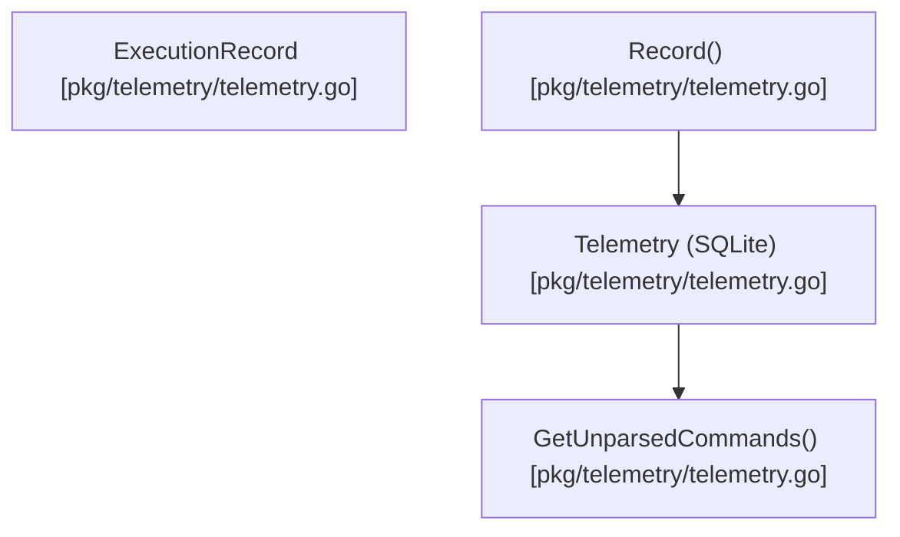

# telemetry

This package manages the recording and retrieval of command execution statistics and unparsed command discovery.

```mermaid
graph TD
    ExecutionRecord["ExecutionRecord [pkg/telemetry/telemetry.go]"]
    Telemetry["Telemetry (SQLite) [pkg/telemetry/telemetry.go]"]
    Record["Record() [pkg/telemetry/telemetry.go]"]
    GetUnparsed["GetUnparsedCommands() [pkg/telemetry/telemetry.go]"]
    
    Record --> Telemetry
    Telemetry --> GetUnparsed
```
